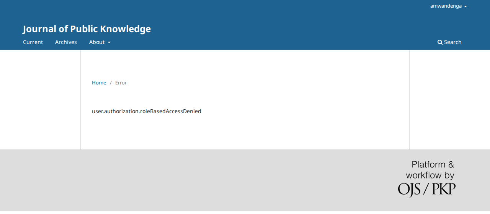

# The "access denied" page shows a raw text key instead of its sentence

- **Severity** low
- **Effort** small
- **Kind** defect (introduced by an open PR; nothing is merged)
- **Affects**
  - main: none yet; OJS (any theme); OMP and OPS (code) once the PRs merge
  - 3.5, 3.4, 3.3: none (the PRs target `main`)
- **Introduced** `pkp-lib#13260` for `pkp-lib#13242` (the Blade theme "Eidos") · open PR · reviewed 2026-10-08 · Nate Wright (NateWr)
- **Upstream** `pkp-lib#13242` (open)
- **Tracked in** ci-triage companion row for pkp/ojs#5784 · overview [2026-10-08-pkp-lib-13260.md](2026-10-08-pkp-lib-13260.md) · Temporary: delete once acted on
- **Checked** 2026-10-08, the PR heads (the commits in Evidence)
- **Model** claude-opus-5-5

## Summary

A signed-in user who opens a page their role may not use is sent to the
refusal page. With the PRs it reads
`user.authorization.roleBasedAccessDenied` instead of "The current role
does not have access to this operation." Every refusal of every kind goes
through this page, which is why about 30 of the 84 red Playwright tests
on ojs#5784 fail on it.

## Impact

- **Lost**: the explanation; the refusal itself still holds.
- **Who**: every user who meets a refusal (a wrong role, a stage they are not assigned to, a switched-off feature), in all three apps.
- **Way round**: none needed to get on, but the text is meaningless to a user.

Low: a raw translation key; nothing is lost.

## Steps to reproduce

Preconditions: PKP's default dataset. The "Eidos" theme is never enabled or selected in these steps; the journal stays on the Default theme.

1. Sign in as `amwandenga` (an author).
2. Open `/index.php/publicknowledge/en/management/settings/website`.

**Expected**: "The current role does not have access to this operation."
**Observed**: breadcrumb "Home / Error" and the text `user.authorization.roleBasedAccessDenied`.

**On `main` today:**


**With the PRs:**



The same page carries every other refusal, each now as its key: the tests wait there for "You
don't currently have access to that stage of the workflow.", "You cannot call this operation
without DOIs enabled.", "The current user is not assigned as a reviewer for the requested
document." and "This journal does not publish its content online.".

## Cause

`lib/pkp/pages/user/PKPUserHandler.php`, `authorizationDenied()`:

```php
$authorizationMessage = $request->getUserVar('message');     // a locale key, checked against /^[a-zA-Z0-9.]+$/
…
$templateMgr->displaySystemMessage(
    title: __('common.error'),
    message: $authorizationMessage,                            // the key itself
);
```

Before the change the key went to `frontend/pages/message.tpl`, which translated it
(`{translate key=$message}`). The new `system-message.tpl` (and Eidos's
`system-message.blade`) print `$message` as text.

## Proposed fix

```diff
-            message: $authorizationMessage,
+            message: __($authorizationMessage),
```

Tried: the page reads "The current role does not have access to this operation." again. Together
with the fix of finding 5 it also gets the heading "Error" and the tab title "Error | Journal of
Public Knowledge" (on `main` it has neither). The same line serves Eidos's template.

## Evidence

- **Refs.** ojs `b8904676e1` (ojs#5784, on the ojs tip `49515c6e3e`), lib/pkp `571ea1fcac` (pkp-lib#13260, on `151e6e9d69`), lib/ui-library `96764aa9` (ui-library#972, on `7f5e51ca`); PostgreSQL, PHP 8.3.
- **Driven.** The steps above at the tip and at the PR head (`shots.js`, `SIDE=before|after`), and
  with the fix (`SIDE=fixed`); fix in `fix-pkp-lib.diff`. With all trial fixes, the red tests that
  wait for a refusal sentence pass (48 of 64 red main-pass tests pass in that run).
- **Not driven.** OMP and OPS (shared handler; with finding 1 they do not get this far).
