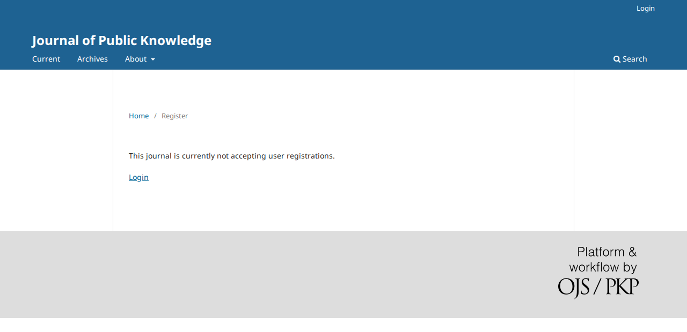

# Message pages lose their heading and their tab title

- **Severity** low
- **Effort** small
- **Kind** defect (introduced by an open PR; nothing is merged)
- **Affects**
  - main: none yet; OJS (themes that use the Smarty templates; Eidos has its own); OMP and OPS (code) once the PRs merge
  - 3.5, 3.4, 3.3: none (the PRs target `main`)
- **Introduced** `pkp-lib#13260` for `pkp-lib#13242` (the Blade theme "Eidos") · open PR · reviewed 2026-10-08 · Nate Wright (NateWr)
- **Upstream** `pkp-lib#13242` (open)
- **Tracked in** ci-triage companion row for pkp/ojs#5784 · overview [2026-10-08-pkp-lib-13260.md](2026-10-08-pkp-lib-13260.md) · Temporary: delete once acted on
- **Checked** 2026-10-08, the PR heads (the commits in Evidence)
- **Model** claude-opus-5-5

## Summary

The pages that show one message (registration closed, "Registration
awaiting verification", "Section Closed", "Not Allowed", the payment
messages and others) now render an empty `<h1>`, and the browser tab
shows no page name. On a few pages the tab shows the title between `##`
marks instead.

## Impact

- **Lost**: the page's heading and its name in the tab and in the browser history; an empty `<h1>` for screen readers.
- **Who**: every visitor or user who lands on one of these pages, on the Default theme and every theme built on the Smarty templates.
- **Way round**: none needed; the message itself is shown.

Low: a missing heading; nothing is lost.

## Steps to reproduce

Preconditions: PKP's default dataset. The "Eidos" theme is never enabled or selected in these steps; the journal stays on the Default theme.

1. As `dbarnes`, switch registration off: Users & Roles › Site Access › "User Registration" › "The Journal Manager will register all user accounts. Editors or Section Editors may register user accounts for reviewers." › "Save".
2. As a visitor open `/index.php/publicknowledge/en/user/register`.

**Expected**: the heading "Register" and the tab "Register | Journal of Public Knowledge".
**Observed**: no heading (an empty `<h1>`), the tab reads "| Journal of Public Knowledge".

**On `main` today:**


**With the PRs:**



Also seen: the page an invalid password-reset link leads to
(`/login/resetPassword/dbarnes?confirm=abc`) keeps its heading, and its tab reads
`##Reset Password## | Journal of Public Knowledge` (on `main`: "Reset Password | …").

## Cause

`PKPTemplateManager::displaySystemMessage()` assigns the title as `title`:

```php
$this->assign(['title' => $title, 'message' => $message, 'type' => $type, …]);
$this->display('frontend/pages/system-message.tpl');
```

but `templates/frontend/pages/system-message.tpl` prints another variable:

```smarty
<h1>
    {$pageTitle}
</h1>
```

and `templates/frontend/components/header.tpl` builds the tab title from `$pageTitle` as a key:
`{if !$pageTitleTranslated}{capture assign="pageTitleTranslated"}{translate key=$pageTitle}{/capture}{/if}`.
`$pageTitle` is no longer assigned by these callers; where an earlier line of the handler still
assigns it as a translated sentence (the reset-link page), the heading shows and the tab translates
the sentence as if it were a key, hence the `##` marks.

## Proposed fix

Two lines, both tried:

```diff
 // templates/frontend/pages/system-message.tpl
-		{$pageTitle}
+		{$title}
 // PKPTemplateManager::displaySystemMessage()
             'title' => $title,
+            'pageTitleTranslated' => $title,
```

Tried: the closed-registration page shows the heading "Register" and the tab "Register | Journal of
Public Knowledge"; the reset-link page's tab reads "Reset Password | …"; the tests U02 S5 and S7,
U21 S9 and S12 and U52 S3 pass.

## Evidence

- **Refs.** ojs `b8904676e1` (ojs#5784, on the ojs tip `49515c6e3e`), lib/pkp `571ea1fcac` (pkp-lib#13260, on `151e6e9d69`), lib/ui-library `96764aa9` (ui-library#972, on `7f5e51ca`); PostgreSQL, PHP 8.3.
- **Driven.** The steps above at the tip and at the PR head (`shots.js`), and with the fix
  (`SIDE=fixed`); fix in `fix-pkp-lib.diff`.
- **By their tests, not walked by hand.** "Registration awaiting verification" (U02 S7), "Section
  Closed" and "Not Allowed" (U21 S12, S9), the payment message (U52 S3): red at the PR head on the
  missing heading, green with the fix.
