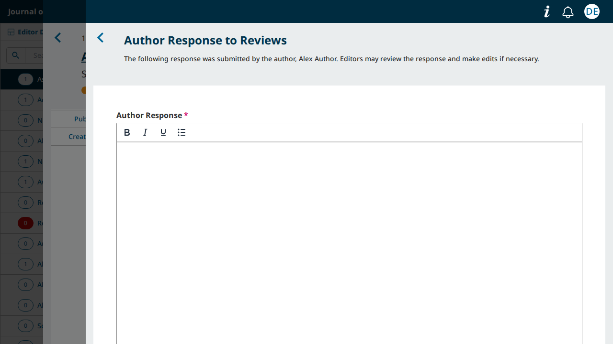

# OJS: the editor's "Author Response to Reviews" window opens with the response empty

- **Severity** medium (high if no other screen shows an editor the response)
- **Effort** medium
- **Kind** defect (introduced by an open PR; nothing is merged)
- **Affects**
  - main: none yet; OJS (the review stage, any theme) once the PRs merge
  - 3.5, 3.4, 3.3: none (the PRs target `main`)
- **Introduced** `pkp-lib#13260` for `pkp-lib#13242` (the Blade theme "Eidos") · open PR · reviewed 2026-10-08 · Nate Wright (NateWr)
- **Upstream** `pkp-lib#13242` (open)
- **Tracked in** ci-triage companion row for pkp/ojs#5784 · overview [2026-10-08-pkp-lib-13260.md](2026-10-08-pkp-lib-13260.md) · Temporary: delete once acted on
- **Checked** 2026-10-08, the PR heads (the commits in Evidence)
- **Model** claude-opus-5-5

## Summary

When an author has answered the reviews of a round, the editor opens the
answer from the round's "Author Response" table ("…" › "View"). With the
PRs the window's "Author Response" field is empty. This is a backend
screen; no reader theme is involved.

## Impact

- **Lost**: the editor cannot read the author's response in the workflow, and the window stays open after the editor's "Save" (U30 S3).
- **Who**: editors of every OJS journal that uses author responses.
- **Way round**: none known.

Medium; high if no other screen shows an editor the text (see Evidence).

## Steps to reproduce

Preconditions: OJS, a submission in review whose round 1 has a completed review (on PKP's default
dataset submission 10 is in that state, with `dbarnes` as editor and `jnovak` as author; the
screenshots below are from a test journal set up the same way, with its own users). No theme change.

1. As the editor open the submission's Review stage and press "Request Response" in the "Author Response" table; send the request.
2. As the author open the submission, press "Submit Response" on the "Respond to Reviews" card, type "We answered the first round's reviews." and submit.
3. As the editor, in the "Author Response" table open "…" › "View".

**Expected**: the window "Author Response to Reviews" with the author's text in "Author Response".
**Observed**: the field is empty.

**On `main` today:**


**With the PRs:**



## Cause

pkp-lib#13260 changes what the API returns for a response
(`api/v1/reviews/resources/ReviewRoundAuthorResponseResource.php`, line 39):

```diff
-            'response' => $response->authorResponse,
+            'response' => $response->getLocalizedData('authorResponse'),
```

`response` was the text per language (`{"en": "…", "fr_CA": "…"}`) and is now one string. The
workflow's form still reads it as the field's value per language (ui-library
`src/managers/ReviewRoundResponseManager/useAuthorResponseForm.js:124`,
`authorResponse: reviewRound.authorResponse.response`), so the editor gets no value for any
language. The change was made for the reader side: ui-library#972's
`PkpOpenReviewAuthorResponseContent.vue` and Eidos's `tab-peer-review.blade` now expect a string.

## Proposed fix

Leave `response` as it was for the workflow and give the reader side its own key, for example:

```php
'response' => $response->authorResponse,                                   // per language, as the workflow form reads it
'localizedResponse' => $response->getLocalizedData('authorResponse'),      // for the reader-facing components
```

with `PkpOpenReviewAuthorResponseContent.vue` and `tab-peer-review.blade` reading
`localizedResponse`. Tried: with `response` restored the window shows the text and U30 S3 and S8
pass; the reader side with the new key was not written.

## Evidence

- **Refs.** ojs `b8904676e1` (ojs#5784, on the ojs tip `49515c6e3e`), lib/pkp `571ea1fcac` (pkp-lib#13260, on `151e6e9d69`), lib/ui-library `96764aa9` (ui-library#972, on `7f5e51ca`); PostgreSQL, PHP 8.3.
- **Driven.** The steps above through the suite's own scenario (U30 S8, "a past round's response
  beside an empty new round") at the tip and at the PR head, a screenshot taken when the editor's
  window is open; at the PR head the test then fails on
  `expect(editorView.body()).toContainText("We answered the first round's reviews.")`, received `""`.
  U30 S3 fails on the window still open after "Save". Fix in `fix-pkp-lib.diff`.
- **Not affected.** OMP and OPS: only OJS's workflow mounts this window
  (`src/pages/workflow/WorkflowPageOJS.vue`).
- **Not searched.** Whether another editor screen shows the response's text.
- **Not walked on the default dataset.** The steps were run on a test journal; submission 10 is
  named from the dataset's tables.
