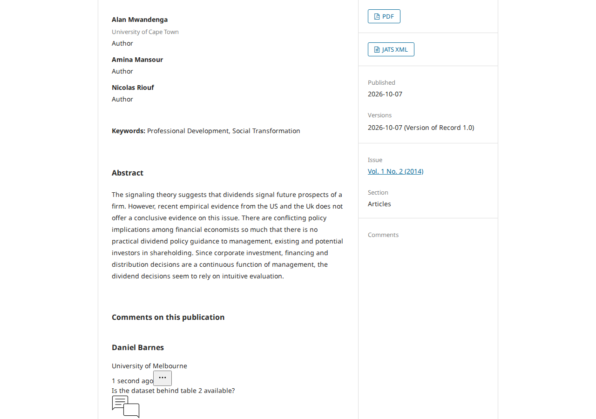
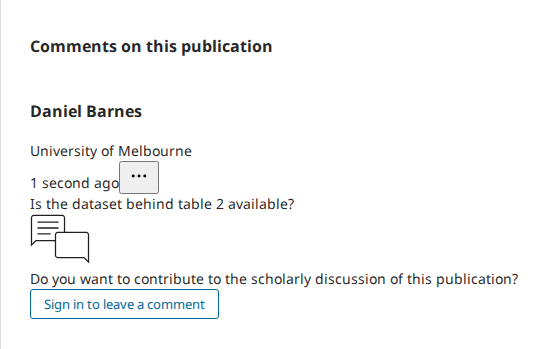

# OJS, Default theme: the comments lose their sidebar box and their layout

- **Severity** low (the comments still work; medium if the lost sidebar link counts as a lost way to them)
- **Effort** large (a decision first; either option is then about a day)
- **Kind** defect (introduced by an open PR; nothing is merged)
- **Affects**
  - main: none yet; OJS with public comments on (the Default theme) once the PRs merge
  - 3.5, 3.4, 3.3: none (the PRs target `main`)
- **Introduced** `ui-library#972` with `ojs#5784` for `pkp-lib#13242` (the Blade theme "Eidos") · open PR · reviewed 2026-10-08 · Nate Wright (NateWr)
- **Upstream** `pkp-lib#13242` (open)
- **Tracked in** ci-triage companion row for pkp/ojs#5784 · overview [2026-10-08-pkp-lib-13260.md](2026-10-08-pkp-lib-13260.md) · Temporary: delete once acted on
- **Checked** 2026-10-08, the PR heads (the commits in Evidence)
- **Model** claude-opus-5-5

## Summary

On a journal with public comments on, the article page of the Default
theme has two comment areas: a "Comments" box in the sidebar and the
comments themselves under the abstract. With the PRs the sidebar box is
a heading with nothing under it, and the comments are rendered by new
components the Default theme has no styles for. Writing and reading a
comment still works.

## Impact

- **Lost**: the sidebar's "All Comments (n)" link and its "Log in to comment" button; the per-version heading with its count ("Version of Record 1.0 (1)"); the comments' layout (the card, the buttons' styling).
- **Who**: readers of OJS journals on the Default theme that switched public comments on.
- **Way round**: scroll to the comments; they are there.

Low: nothing is lost that scrolling does not reach, but the part looks broken on the theme most journals use. Ten of the red tests (U14) are this.

## Steps to reproduce

Preconditions: PKP's default dataset. The "Eidos" theme is never enabled or selected in these steps; the journal stays on the Default theme.

1. As `dbarnes` switch public comments on: Settings › Website › Content › Comments › tick "Enable Public Comments" › "Save".
2. Still as `dbarnes`, open article 1 ("The Signalling Theory Dividends"), write a comment under "Comments on this publication" and submit it; then approve it on the dashboard's "Comments" page.
3. As a visitor open article 1.

**Expected** (as on `main`): the sidebar box reads "Comments", "All Comments (1)", "Log in to
comment"; the comments start with "Version of Record 1.0 (1)".
**Observed**: the sidebar box holds the word "Comments" alone; the comments have no version heading
and no styling.

**On `main` today:**

**With the PRs:**

The comments area alone:

**On `main` today:**

**With the PRs:**

## Cause

- ui-library#972 deletes `PkpScrollToComments` (with `PkpScrollToCommentsAllComments`,
  `PkpScrollToCommentsLogInto` and eight more comment sub-components) and rebuilds `PkpComments`
  from new ones (`PkpComment`, `PkpCommentAdd`, `PkpCommentsCta`, `PkpCommentsVersionDivider`);
  pkp-lib#13260 removes their registrations from `js/load_frontend.js`.
- The Default theme's `templates/frontend/objects/article_details.tpl` still has
  `<pkp-scroll-to-comments></pkp-scroll-to-comments>` (line 514), now an unknown element that
  renders nothing.
- ojs#5784 removes 44 lines for the old markup from the Default theme's
  `plugins/themes/default/styles/components/comments.less` and adds none for the new markup.

## Proposed fix

Not tried; it needs the author's decision between:

1. **Bring the Default theme along in the same PRs**: replace the sidebar element in
   `article_details.tpl` with what the new components offer (or a plain link to
   `#public-comments` with the count), and style the new classes (`PkpComment…`, `PkpCommentsCta`)
   in `comments.less`.
2. **Keep the old components** in ui-library and registered in `load_frontend.js` until the Default
   theme is retired, with the new ones beside them for Eidos.

## Evidence

- **Refs.** ojs `b8904676e1` (ojs#5784, on the ojs tip `49515c6e3e`), lib/pkp `571ea1fcac` (pkp-lib#13260, on `151e6e9d69`), lib/ui-library `96764aa9` (ui-library#972, on `7f5e51ca`); PostgreSQL, PHP 8.3.
- **Driven.** The steps above at the tip and at the PR head (`shots.js`; the setting switched on
  through the API and the comment approved in the database instead of on the two screens; the
  comment written through the page's own form on both sides, POST 200). At the PR head the page holds an
  unresolved `<pkp-scroll-to-comments>` element.
- **Tests.** U14 S1, S2, S4, S7, S8, S9, S10, S11, S12, S13 are red at the PR head and stay red with
  every trial fix of the other findings.
- **Related, not driven.** The comments' sign-in link now returns to `?section=comments` (an Eidos
  tab) instead of `#public-comments`, and the comments API takes `submissionId` /
  `submissionIds` instead of `publicationId` / `publicationIds`.
