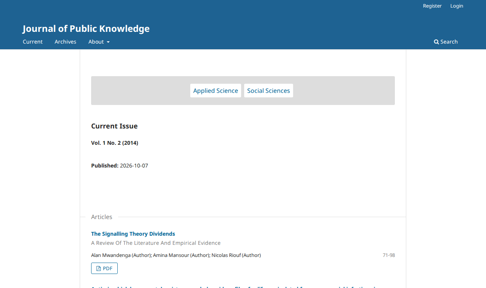

# OJS, Default theme: the journal's home page lists the categories whatever the theme option says

- **Severity** medium
- **Effort** small (the guard below; medium if block loading is redesigned)
- **Kind** defect (introduced by an open PR; nothing is merged)
- **Affects**
  - main: none yet; OJS (the Default theme; every journal that has categories) once the PRs merge
  - 3.5, 3.4, 3.3: none (the PRs target `main`)
- **Introduced** `ojs#5784` for `pkp-lib#13242` (the Blade theme "Eidos") · open PR · reviewed 2026-10-08 · Nate Wright (NateWr)
- **Upstream** `pkp-lib#13242` (open)
- **Tracked in** ci-triage companion row for pkp/ojs#5784 · overview [2026-10-08-pkp-lib-13260.md](2026-10-08-pkp-lib-13260.md) · Temporary: delete once acted on
- **Checked** 2026-10-08, the PR heads (the commits in Evidence)
- **Model** claude-opus-5-5

## Summary

The Default theme lists a journal's categories at the top of its home
page only when the theme option "category listing" is chosen. With the
PRs every journal that has categories shows them there, whatever the
option says.

## Impact

- **Lost**: the journal's choice of what its home page shows.
- **Who**: every OJS journal on the Default theme that has categories and did not choose the listing.
- **Way round**: none in the settings (the option is already off).

Medium: a visible change to the home page of existing journals, with no setting to undo it.

## Steps to reproduce

Preconditions: PKP's default dataset (two categories; the theme option holds the issue's table of contents alone). The "Eidos" theme is never enabled or selected in these steps; the journal stays on the Default theme.

1. As a visitor open the journal's home page (`/index.php/publicknowledge/en`).

**Expected**: the page starts with "Current Issue". **Observed**: "Applied Science" and "Social
Sciences" above it.

**On `main` today:**


**With the PRs:**



## Cause

`pages/index/IndexHandler.php` assigns `categories` only when the theme option asks for the listing
(around line 75). ojs#5784 adds, after it, a call that runs every registered homepage block's loader,
for every theme:

```php
$homepageBlocks = $templateMgr->homepageBlocks->load($journal);
```

The "categories" block's loader in the new `classes/view/HomepageBlocksRegistry.php` (line 167)
assigns `categories` as well, and the Default theme's `indexJournal.tpl` (line 37) shows the list
whenever that variable is set. The loaders also run their queries on every home page view of any
theme (a count of the published submissions, the recent issues, two file-genre lookups), and the
first two are what fails in finding 3.

## Proposed fix

Run the loaders only for a theme that shows homepage blocks. One way, tried
(`fix-ojs.diff`): the active theme or one of its parents implements `HasHomepageBlocks`, as Eidos
does:

```php
$usesHomepageBlocks = false;
for ($theme = $templateMgr->getActiveTheme($request, $journal); $theme; $theme = $theme->parent ?? null) {
    $usesHomepageBlocks = $usesHomepageBlocks || $theme instanceof \PKP\plugins\interfaces\HasHomepageBlocks;
}
if ($usesHomepageBlocks) {
    $templateMgr->assign(['homepageBlocks' => $templateMgr->homepageBlocks->load($journal)]);
}
```

Tried: the Default theme's home page starts with "Current Issue" again and U10 S9 passes; with
Eidos selected its home page shows the same blocks as without the guard. A finer rule (load only
the blocks the theme's option has selected) would also save Eidos the queries of blocks it does
not show; that is the author's call.

## Evidence

- **Refs.** ojs `b8904676e1` (ojs#5784, on the ojs tip `49515c6e3e`), lib/pkp `571ea1fcac` (pkp-lib#13260, on `151e6e9d69`), lib/ui-library `96764aa9` (ui-library#972, on `7f5e51ca`); PostgreSQL, PHP 8.3.
- **Driven.** The step above at the tip and at the PR head (`shots.js`), and with the fix
  (`SIDE=fixed`). Eidos with the fix: built, enabled and selected on the same dataset, its home
  page's text equal to the run without the fix (`default-theme.js`, `PHASES=eidos`).
- **Tests.** U10 S9 (a journal whose option holds "recent articles" alone):
  `expect(home.categoryLinks).toHaveCount(0)` received 2 at the PR head; passes with the fix.
