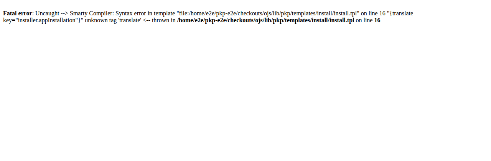
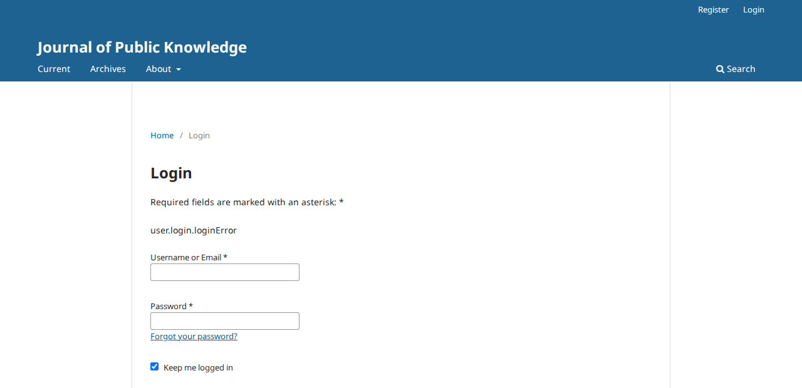
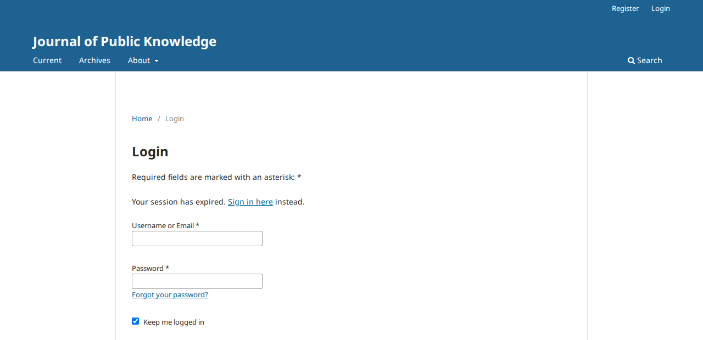
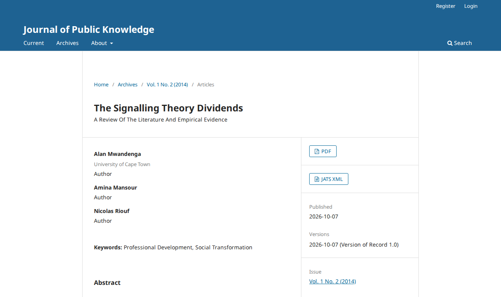

# The Eidos theme PRs change and break pages of installs that never switch to Eidos

- **Severity** critical
- **Effort** medium
- **Kind** defect (bugs a developer's PR introduces; nothing is merged)
- **Crash** server
- **Security** unreleased (finding 6)
- **Affects**
  - main: nothing yet. OJS, OMP, OPS once pkp-lib#13260 merges; OJS for the OJS-only findings
  - 3.5, 3.4, 3.3: none (the PRs target `main`)
- **Introduced** `pkp-lib#13260`, `ui-library#972`, `ojs#5784` for
  `pkp-lib#13242` · open PRs, heads in Evidence · 2026-10-08 · Nate Wright (NateWr)
- **Upstream** `pkp-lib#13242` (open; its PR list has no OMP or OPS PR)
- **Tracked in** ci-triage companion row `eidos` · Temporary: delete once acted on
- **Checked** 2026-10-08, the PR heads (the commits in Evidence)
- **Model** claude-opus-5-5

## Summary

The theme itself is opt-in, but the PRs that bring it also change shared
code every theme runs through. With them merged as they are, a journal
that stays on the Default theme is affected, and so are OMP and OPS.
None of the findings below needs "Eidos" to be enabled or selected: each
shows on the Default theme with the plugin off, as an install leaves it
(finding 11 is the one exception).

| # | Finding | Severity | Fix |
|---|---|---|---|
| [1](#finding-1) | OMP and OPS answer 500 on every page once they receive the pkp-lib change | critical | two options, both tried |
| [2](#finding-2) | The web installer shows a fatal error instead of the installation form | high | one line, tried |
| [3](#finding-3) | OJS: the site's home page answers 500 on PostgreSQL | medium | two lines, tried |
| [4](#finding-4) | The "access denied" page shows a raw text key instead of its sentence | low | one line, tried |
| [5](#finding-5) | Message pages lose their heading and their tab title | low | two lines, tried |
| [6](#finding-6) | The login page prints the address's `loginMessage` as HTML | medium | tried |
| [7](#finding-7) | OJS: the editor's "Author Response to Reviews" window opens with the response empty | medium | editor side tried |
| [8](#finding-8) | OJS, Default theme: every article page shows a "JATS XML" button that links nowhere | low | one line, tried |
| [9](#finding-9) | OJS, Default theme: the comments lose their sidebar box and their layout | low | needs a decision |
| [10](#finding-10) | OJS, Default theme: the journal's home page lists the categories whatever the theme option says | medium | tried |
| [11](#finding-11) | "Eidos" ticked on an unbuilt checkout makes Website Settings answer 500 (short; left without screenshots) | medium | not tried |
| [12](#finding-12) | OMP: "Send notification of payment" answers a blank error page (a shared template was removed) | medium | tried |

Each finding below has the steps, screenshots of `main` and of the PR
heads, the cause in the code and a fix.

Of the 84 red Playwright tests on ojs#5784, 78 come from these findings,
5 from two changes that look intended ("Questions for the author" at the
end) and one is already red on `main`. Every Cypress job is red because
of finding 2. With every trial fix applied, 48 of 64 red tests rerun
locally pass; the 16 left are finding 9 (10 tests), those 5 and the one
known red.

<a name="finding-1"></a>
## Finding 1 — OMP and OPS answer 500 on every page once they receive the pkp-lib change

- **Severity** critical · **Effort** medium (two more app PRs, or a small fallback in pkp-lib) · **Crash** server
- **Affects** OMP, OPS · **Introduced** `pkp-lib#13260`

pkp-lib#13260 makes the template manager create two objects from classes
that only the OJS PR adds. The PR set has no OMP or OPS PR, so a press or
a preprint server fails on every page as soon as its `lib/pkp` moves to a
commit that contains the change. Neither app has the theme at all.

### Impact

- **Lost**: every page that renders a template: the reader pages, the login page, the dashboard.
- **Who**: every visitor and user of every OMP and OPS install on `main`.
- **Way round**: none; the app PRs or the fallback below must merge with pkp-lib#13260.

Critical: nothing works, in every setup.

### Steps to reproduce

1. Take OMP (or OPS) at its tip and check `lib/pkp` out at pkp-lib#13260's head (`571ea1fcac`).
2. Open any page, for example `/index.php/publicknowledge/en`.

**Expected**: the press's home page (here a freshly installed press, which has no content yet).

**On `main` today:**


**Observed**: HTTP 500 with an empty body (a blank page, so no screenshot), on OMP and on OPS. Server log:

```
PHP Fatal error:  Uncaught Error: Class "APP\view\MetadataBlocksRegistry" not found in lib/pkp/classes/template/PKPTemplateManager.php:195
```

### Cause

`lib/pkp/classes/template/PKPTemplateManager.php`, constructor (lines 195–196 at the PR head):

```php
$this->metadataBlocks = new MetadataBlocksRegistry();   // use APP\view\MetadataBlocksRegistry;
$this->homepageBlocks = new HomepageBlocksRegistry();   // use APP\view\HomepageBlocksRegistry;
```

`APP\view\MetadataBlocksRegistry` and `APP\view\HomepageBlocksRegistry` exist only in
ojs#5784 (`classes/view/`). OMP and OPS have no `classes/view/*Registry.php`.

### Proposed fix

Either of two, both tried:

1. **The two classes in OMP and OPS** (PRs that merge together with pkp-lib#13260). The minimum is
   an empty subclass each:

   ```php
   namespace APP\view;
   class MetadataBlocksRegistry extends \PKP\view\MetadataBlocksRegistry {}
   class HomepageBlocksRegistry extends \PKP\view\HomepageBlocksRegistry {}
   ```

   Tried on both apps: the login page, the home page, the catalog and the search page answer 200.
2. **A fallback in pkp-lib**, so that an app without the classes gets pkp-lib's own
   (`fix-pkp-lib-fallback.diff`):

   ```php
   public \PKP\view\MetadataBlocksRegistry $metadataBlocks;
   public \PKP\view\HomepageBlocksRegistry $homepageBlocks;
   …
   $this->metadataBlocks = class_exists(MetadataBlocksRegistry::class) ? new MetadataBlocksRegistry() : new \PKP\view\MetadataBlocksRegistry();
   $this->homepageBlocks = class_exists(HomepageBlocksRegistry::class) ? new HomepageBlocksRegistry() : new \PKP\view\HomepageBlocksRegistry();
   ```

   Tried on both apps: the login page, the home page, the search page and "About" answer 200.

Whichever is chosen, OMP's and OPS's suites have not run on the change yet: every page failed
before a test could start. Findings 4, 5, 6 and 12 reach both apps too.

<a name="finding-2"></a>
## Finding 2 — The web installer shows a fatal error instead of the installation form

- **Severity** high · **Effort** small · **Crash** server
- **Affects** OJS; OMP and OPS (code) · **Introduced** `pkp-lib#13260`

On an install that is not set up yet, the installation page fails with a
fatal error. This is why every Cypress job of ojs#5784 is red: the first
test, "Installs the software", cannot find the form
(`Expected to find element: input[name=adminUsername]`), and every later
test fails behind it. No theme is involved: nothing is enabled before the
install.

### Impact

- **Lost**: installing through the browser.
- **Who**: everyone setting up a new OJS, OMP or OPS from `main`; the apps' own CI.
- **Way round**: the command-line installer (`php tools/install.php`).

High: a setup task fails for everyone, with a way round only on the command line.

### Steps to reproduce

1. A checkout at the PR heads whose configuration file has `installed = Off` (a copy of `config.TEMPLATE.inc.php`).
2. Open `/index.php/index/install`.

**Expected**: the "OJS Installation" form. **Observed**: a fatal error.

**On `main` today:**


**With the PRs:**



The message on screen (`unknown tag 'translate'`) is a follow-up error. The first error in the server log is a
database exception (no database is configured yet), raised from:

```
#13 lib/pkp/classes/site/SiteDAO.php(43): Generator->current()
#14 lib/pkp/classes/core/PKPRequest.php(549): PKP\site\SiteDAO->getSite()
#15 lib/pkp/classes/template/PKPTemplateManager.php(229): PKP\core\PKPRequest->getSite()
#16 classes/template/TemplateManager.php(42): PKP\template\PKPTemplateManager->initialize()
```

### Cause

pkp-lib#13260 adds one line to `PKPTemplateManager::initialize()` (line 229 at the PR head):

```php
'site' => $request->getSite(),
```

It runs for every request. Before the install there is no database to read the site from, so the
query throws; the template manager is left half initialised (its `{translate}` tag is not yet
registered) and the installer's template then fails to compile. The rest of `initialize()` guards
its database reads with `Application::isInstalled()` (lines 254, 272).

### Proposed fix

```diff
-            'site' => $request->getSite(),
+            'site' => Application::isInstalled() ? $request->getSite() : null,
```

Tried: the installation form renders again (HTTP 200, the "Username" field is there), and the
site-level and journal pages still receive `$site` (the pages of the other findings were opened with this line in place).

<a name="finding-3"></a>
## Finding 3 — OJS: the site's home page answers 500 on PostgreSQL

- **Severity** medium (high if MySQL fails too, or if the page is a site's front door) · **Effort** small · **Crash** server
- **Affects** OJS · **Introduced** `ojs#5784`

On a site with more than one journal, the page that lists the journals
(`/index.php/index`) answers HTTP 500 on PostgreSQL. It happens with the
Default theme; Eidos does not need to be enabled. About 27 of the 84 red
Playwright tests on ojs#5784 show this error.

### Impact

- **Lost**: the site's home page, for every visitor.
- **Who**: OJS installs on PostgreSQL that host two or more journals and set no journal redirect.
- **Way round**: none on screen (the journals' own pages work).

Medium: a public page fails for everyone, but only on such an install, and the journals' own pages work.

### Steps to reproduce

Preconditions: OJS on PostgreSQL, PKP's default dataset. The "Eidos" theme is never enabled or selected in these steps; the journal stays on the Default theme.

1. Sign in as `admin` and add a second journal: Administration › Hosted Journals › "Create Journal", name "Second Journal", path `second`, with "Enable this journal to appear publicly on the site" ticked (with one public journal the site's address forwards to that journal instead).
2. Sign out and open `/index.php/index`.

**Expected**: the list of the two journals.

**On `main` today:**


**Observed**: HTTP 500 with an empty body (a blank page). Server log:

```
SQLSTATE[22P02]: Invalid text representation: 7 ERROR:  invalid input syntax for type bigint: "*"
… select count(*) as aggregate from "submissions" as "s" … where "s"."context_id" in (*) and "s"."status" in (3)
#12 classes/view/HomepageBlocksRegistry.php(132): PKP\submission\Collector->getCount()
#17 pages/index/IndexHandler.php(143): PKP\view\HomepageBlocksRegistry->load()
```

With the first query fixed, a second one fails the same way
(`… from "issues" … where "i"."journal_id" in (*)`, `HomepageBlocksRegistry.php(191)`).

### Cause

`pages/index/IndexHandler.php` now calls `$templateMgr->homepageBlocks->load($journal)` on every home
page, whatever the theme. On the site level two loaders in OJS's new
`classes/view/HomepageBlocksRegistry.php` pass the literal `'*'` as the context id:

```php
// "search" block, line 131
->filterByContextIds([$context ? $context->getId() : '*'])
// "recent issues" block, line 185
->filterByContextIds([$context?->getId() ?? '*'])
```

The collectors' wildcard is `Application::SITE_CONTEXT_ID_ALL` (`-1`), which they test for before
adding the `where` (`lib/pkp/classes/submission/Collector.php:471`, `classes/issue/Collector.php:365`);
`'*'` goes into the query as a value. The "latest articles" loader in the same file (line 57) uses
the constant.

### Proposed fix

```diff
-                        ->filterByContextIds([$context ? $context->getId() : '*'])
+                        ->filterByContextIds([$context ? $context->getId() : Application::SITE_CONTEXT_ID_ALL])
…
-                        ->filterByContextIds([$context?->getId() ?? '*'])
+                        ->filterByContextIds([$context?->getId() ?? Application::SITE_CONTEXT_ID_ALL])
```

Tried: the site's home page answers 200 and lists both journals; the twelve red main-pass tests
with this error pass (the serial and solo ones with it were not rerun). The fix of finding 10 (do not run the loaders for a theme that shows no
blocks) would also keep these queries away from the Default theme, but Eidos needs the two lines
either way.

<a name="finding-4"></a>
## Finding 4 — The "access denied" page shows a raw text key instead of its sentence

- **Severity** low · **Effort** small
- **Affects** OJS (any theme); OMP and OPS (code) · **Introduced** `pkp-lib#13260`

A signed-in user who opens a page their role may not use is sent to the
refusal page. With the PRs it reads
`user.authorization.roleBasedAccessDenied` instead of "The current role
does not have access to this operation." Every refusal of every kind goes
through this page, which is why about 30 of the 84 red Playwright tests
on ojs#5784 fail on it.

### Impact

- **Lost**: the explanation; the refusal itself still holds.
- **Who**: every user who meets a refusal (a wrong role, a stage they are not assigned to, a switched-off feature), in all three apps.
- **Way round**: none needed to get on, but the text is meaningless to a user.

Low: a raw translation key; nothing is lost.

### Steps to reproduce

Preconditions: PKP's default dataset. The "Eidos" theme is never enabled or selected in these steps; the journal stays on the Default theme.

1. Sign in as `amwandenga` (an author).
2. Open `/index.php/publicknowledge/en/management/settings/website`.

**Expected**: "The current role does not have access to this operation."
**Observed**: breadcrumb "Home / Error" and the text `user.authorization.roleBasedAccessDenied`.

**On `main` today:**


**With the PRs:**


The same page carries every other refusal, each now as its key: the tests wait there for "You
don't currently have access to that stage of the workflow.", "You cannot call this operation
without DOIs enabled.", "The current user is not assigned as a reviewer for the requested
document." and "This journal does not publish its content online.".

### Cause

`lib/pkp/pages/user/PKPUserHandler.php`, `authorizationDenied()`:

```php
$authorizationMessage = $request->getUserVar('message');     // a locale key, checked against /^[a-zA-Z0-9.]+$/
…
$templateMgr->displaySystemMessage(
    title: __('common.error'),
    message: $authorizationMessage,                            // the key itself
);
```

Before the change the key went to `frontend/pages/message.tpl`, which translated it
(`{translate key=$message}`). The new `system-message.tpl` (and Eidos's
`system-message.blade`) print `$message` as text.

### Proposed fix

```diff
-            message: $authorizationMessage,
+            message: __($authorizationMessage),
```

Tried: the page reads "The current role does not have access to this operation." again. Together
with the fix of finding 5 it also gets the heading "Error" and the tab title "Error | Journal of
Public Knowledge" (on `main` it has neither). The same line serves Eidos's template.

<a name="finding-5"></a>
## Finding 5 — Message pages lose their heading and their tab title

- **Severity** low · **Effort** small
- **Affects** OJS (themes that use the Smarty templates; Eidos has its own); OMP and OPS (code) · **Introduced** `pkp-lib#13260`

The pages that show one message (registration closed, "Registration
awaiting verification", "Section Closed", "Not Allowed", the payment
messages and others) now render an empty `<h1>`, and the browser tab
shows no page name. On a few pages the tab shows the title between `##`
marks instead.

### Impact

- **Lost**: the page's heading and its name in the tab and in the browser history; an empty `<h1>` for screen readers.
- **Who**: every visitor or user who lands on one of these pages, on the Default theme and every theme built on the Smarty templates.
- **Way round**: none needed; the message itself is shown.

Low: a missing heading; nothing is lost.

### Steps to reproduce

Preconditions: PKP's default dataset. The "Eidos" theme is never enabled or selected in these steps; the journal stays on the Default theme.

1. As `dbarnes`, switch registration off: Users & Roles › Site Access › "User Registration" › "The Journal Manager will register all user accounts. Editors or Section Editors may register user accounts for reviewers." › "Save".
2. As a visitor open `/index.php/publicknowledge/en/user/register`.

**Expected**: the heading "Register" and the tab "Register | Journal of Public Knowledge".
**Observed**: no heading (an empty `<h1>`), the tab reads "| Journal of Public Knowledge".

**On `main` today:**


**With the PRs:**


Also seen: the page an invalid password-reset link leads to
(`/login/resetPassword/dbarnes?confirm=abc`) keeps its heading, and its tab reads
`##Reset Password## | Journal of Public Knowledge` (on `main`: "Reset Password | …").

### Cause

`PKPTemplateManager::displaySystemMessage()` assigns the title as `title`:

```php
$this->assign(['title' => $title, 'message' => $message, 'type' => $type, …]);
$this->display('frontend/pages/system-message.tpl');
```

but `templates/frontend/pages/system-message.tpl` prints another variable:

```smarty
<h1>
    {$pageTitle}
</h1>
```

and `templates/frontend/components/header.tpl` builds the tab title from `$pageTitle` as a key:
`{if !$pageTitleTranslated}{capture assign="pageTitleTranslated"}{translate key=$pageTitle}{/capture}{/if}`.
`$pageTitle` is no longer assigned by these callers; where an earlier line of the handler still
assigns it as a translated sentence (the reset-link page), the heading shows and the tab translates
the sentence as if it were a key, hence the `##` marks.

### Proposed fix

Two lines, both tried:

```diff
 // templates/frontend/pages/system-message.tpl
-		{$pageTitle}
+		{$title}
 // PKPTemplateManager::displaySystemMessage()
             'title' => $title,
+            'pageTitleTranslated' => $title,
```

Tried: the closed-registration page shows the heading "Register" and the tab "Register | Journal of
Public Knowledge"; the reset-link page's tab reads "Reset Password | …"; the tests U02 S5 and S7,
U21 S9 and S12 and U52 S3 pass.

<a name="finding-6"></a>
## Finding 6 — The login page prints the address's `loginMessage` as HTML

- **Severity** medium · **Effort** small · **Security** unreleased
- **Affects** OJS (any theme); OMP and OPS (code) · **Introduced** `pkp-lib#13260`

The login page shows a notice above the form that comes from the
`loginMessage` parameter of its address. On `main` and on 3.5 the
parameter is a text key that the page translates. With the PRs the page
prints the parameter itself, as HTML: links and images survive (scripts
are stripped). Two effects: a link the application built before the
change, or a bookmark, now shows a raw key; and a prepared link can put
any sentence with a working link above a journal's real login form.

### Impact

- **Lost**: the notice for existing links (a key instead of a sentence); and the guarantee that the text above the login form is the application's own.
- **Who**: any visitor who follows a link to the login page.
- **Way round**: none.

Medium: a page that can mislead, on every install, needing a prepared link.

### Steps to reproduce

Preconditions: PKP's default dataset. The "Eidos" theme is never enabled or selected in these steps; the journal stays on the Default theme.

1. As a visitor open `/index.php/publicknowledge/en/login?loginMessage=user.login.loginError`.

   **Expected**: "Invalid username/email or password. Please try again." **Observed**: `user.login.loginError`.

**On `main` today:**


**With the PRs:**



2. Open
   `/index.php/publicknowledge/en/login?loginMessage=Your session has expired. <a href="https://example.org/">Sign in here</a> instead.`

   **Expected**: no text from the address on the page. **Observed**: the sentence above the form, "Sign in here" a working link to example.org.



### Cause

Two changes in pkp-lib#13260 turn the key into free text:

```diff
 // classes/security/Validation.php, redirectLogin()
-            $args['loginMessage'] = $message;
+            $args['loginMessage'] = __($messageLocaleKey);     // the sentence now travels in the address
```

```diff
 {* templates/frontend/pages/userLogin.tpl *}
-			{translate key=$loginMessage}
+			{$loginMessage|strip_unsafe_html}
```

`LoginHandler::index()` passes `$request->getUserVar('loginMessage')` to the template unchecked, as
before. Eidos's `userLogin.blade` prints it the same way (`ViewHelper::sanitizeHtml($loginMessage)`).

### Proposed fix

Keep the parameter a key and translate it in the handler, behind the check the refusal page
already applies to its own `message` parameter ("sanity check (for XSS or phishing)" in
`PKPUserHandler::authorizationDenied()`):

```diff
 // classes/security/Validation.php
-            $args['loginMessage'] = __($messageLocaleKey);
+            $args['loginMessage'] = $messageLocaleKey;
 // pages/login/LoginHandler.php
+        $loginMessageKey = $request->getUserVar('loginMessage');
         $templateMgr->assign([
-            'loginMessage' => $request->getUserVar('loginMessage'),
+            'loginMessage' => is_string($loginMessageKey) && preg_match('/^[a-zA-Z0-9.]+$/', $loginMessageKey) ? __($loginMessageKey) : null,
```

The two templates stay as the PR has them (they print the translated sentence). Tried: step 1
shows the sentence again; step 2 shows no notice; the login page on Eidos is unchanged.

<a name="finding-7"></a>
## Finding 7 — OJS: the editor's "Author Response to Reviews" window opens with the response empty

- **Severity** medium (high if no other screen shows an editor the response) · **Effort** medium
- **Affects** OJS (the review stage, any theme) · **Introduced** `pkp-lib#13260`

When an author has answered the reviews of a round, the editor opens the
answer from the round's "Author Response" table ("…" › "View"). With the
PRs the window's "Author Response" field is empty. This is a backend
screen; no reader theme is involved.

### Impact

- **Lost**: the editor cannot read the author's response in the workflow, and the window stays open after the editor's "Save" (U30 S3).
- **Who**: editors of every OJS journal that uses author responses.
- **Way round**: none known.

Medium; high if no other screen shows an editor the text (see Evidence).

### Steps to reproduce

Preconditions: OJS, a submission in review whose round 1 has a completed review (on PKP's default
dataset submission 10 is in that state, with `dbarnes` as editor and `jnovak` as author; the
screenshots below are from a test journal set up the same way, with its own users). No theme change.

1. As the editor open the submission's Review stage and press "Request Response" in the "Author Response" table; send the request.
2. As the author open the submission, press "Submit Response" on the "Respond to Reviews" card, type "We answered the first round's reviews." and submit.
3. As the editor, in the "Author Response" table open "…" › "View".

**Expected**: the window "Author Response to Reviews" with the author's text in "Author Response".
**Observed**: the field is empty.

**On `main` today:**


**With the PRs:**


### Cause

pkp-lib#13260 changes what the API returns for a response
(`api/v1/reviews/resources/ReviewRoundAuthorResponseResource.php`, line 39):

```diff
-            'response' => $response->authorResponse,
+            'response' => $response->getLocalizedData('authorResponse'),
```

`response` was the text per language (`{"en": "…", "fr_CA": "…"}`) and is now one string. The
workflow's form still reads it as the field's value per language (ui-library
`src/managers/ReviewRoundResponseManager/useAuthorResponseForm.js:124`,
`authorResponse: reviewRound.authorResponse.response`), so the editor gets no value for any
language. The change was made for the reader side: ui-library#972's
`PkpOpenReviewAuthorResponseContent.vue` and Eidos's `tab-peer-review.blade` now expect a string.

### Proposed fix

Leave `response` as it was for the workflow and give the reader side its own key, for example:

```php
'response' => $response->authorResponse,                                   // per language, as the workflow form reads it
'localizedResponse' => $response->getLocalizedData('authorResponse'),      // for the reader-facing components
```

with `PkpOpenReviewAuthorResponseContent.vue` and `tab-peer-review.blade` reading
`localizedResponse`. Tried: with `response` restored the window shows the text and U30 S3 and S8
pass; the reader side with the new key was not written.

<a name="finding-8"></a>
## Finding 8 — OJS, Default theme: every article page shows a "JATS XML" button that links nowhere

- **Severity** low (a dead button, nothing lost; on every article page) · **Effort** small
- **Affects** OJS (the Default theme and themes that use its `article_details.tpl`) · **Introduced** `ojs#5784`

Every article's page now shows a "JATS XML" download button beside "PDF",
also when the journal does not publish JATS for the article. The button's
link is empty, so it reloads the page.

### Impact

- **Lost**: nothing; a reader is offered a download that does not exist.
- **Who**: readers of every OJS journal on the Default theme, on every article.
- **Way round**: none needed.

Low: a dead control. It sits on the most-read public page of every journal, which is the reason to fix it before the merge.

### Steps to reproduce

Preconditions: PKP's default dataset. The "Eidos" theme is never enabled or selected in these steps; the journal stays on the Default theme.

1. As a visitor open article 1, "The Signalling Theory Dividends" (`/index.php/publicknowledge/en/article/view/1`).

**Expected**: one galley button, "PDF". **Observed**: "PDF" and "JATS XML"; the second is
`<a class="obj_galley_link xml" href="">`.

**On `main` today:**


**With the PRs:**



### Cause

`pages/article/ArticleHandler.php` assigned `jatsDownloadUrl` only when the publication's JATS is
public. ojs#5784 always assigns it, empty when it is not (around line 336 at the PR head):

```php
$templateMgr->assign([
    'jatsDownloadUrl' => $publication->getData('jatsPublicVisibility')
        ? $request->getDispatcher()->url(…)
        : ''
]);
```

The Default theme's `templates/frontend/objects/article_details.tpl` (line 344) asks whether the
variable exists, not whether it holds an address:

```smarty
{if isset($jatsDownloadUrl)}
```

### Proposed fix

```diff
-			{if isset($jatsDownloadUrl)}
+			{if $jatsDownloadUrl}
```

Tried: article 1 shows "PDF" alone; U46 S3, U48 S4 and S5 pass (S4 checks that the link still
appears when JATS is public). Eidos's own `download.blade` is not touched by it. Third-party themes
that copied the `isset()` test show the same dead button; leaving the variable unassigned when
there is no address, as before, would spare them too.

<a name="finding-9"></a>
## Finding 9 — OJS, Default theme: the comments lose their sidebar box and their layout

- **Severity** low (the comments still work; medium if the lost sidebar link counts as a lost way to them) · **Effort** large (a decision first; either option is then about a day)
- **Affects** OJS with public comments on (the Default theme) · **Introduced** `ui-library#972` with `ojs#5784`

On a journal with public comments on, the article page of the Default
theme has two comment areas: a "Comments" box in the sidebar and the
comments themselves under the abstract. With the PRs the sidebar box is
a heading with nothing under it, and the comments are rendered by new
components the Default theme has no styles for. Writing and reading a
comment still works.

### Impact

- **Lost**: the sidebar's "All Comments (n)" link and its "Log in to comment" button; the per-version heading with its count ("Version of Record 1.0 (1)"); the comments' layout (the card, the buttons' styling).
- **Who**: readers of OJS journals on the Default theme that switched public comments on.
- **Way round**: scroll to the comments; they are there.

Low: nothing is lost that scrolling does not reach, but the part looks broken on the theme most journals use. Ten of the red tests (U14) are this.

### Steps to reproduce

Preconditions: PKP's default dataset. The "Eidos" theme is never enabled or selected in these steps; the journal stays on the Default theme.

1. As `dbarnes` switch public comments on: Settings › Website › Content › Comments › tick "Enable Public Comments" › "Save".
2. Still as `dbarnes`, open article 1 ("The Signalling Theory Dividends"), write a comment under "Comments on this publication" and submit it; then approve it on the dashboard's "Comments" page.
3. As a visitor open article 1.

**Expected** (as on `main`): the sidebar box reads "Comments", "All Comments (1)", "Log in to
comment"; the comments start with "Version of Record 1.0 (1)".
**Observed**: the sidebar box holds the word "Comments" alone; the comments have no version heading
and no styling.

**On `main` today:**


**With the PRs:**


The comments area alone:

**On `main` today:**


**With the PRs:**


### Cause

- ui-library#972 deletes `PkpScrollToComments` (with `PkpScrollToCommentsAllComments`,
  `PkpScrollToCommentsLogInto` and eight more comment sub-components) and rebuilds `PkpComments`
  from new ones (`PkpComment`, `PkpCommentAdd`, `PkpCommentsCta`, `PkpCommentsVersionDivider`);
  pkp-lib#13260 removes their registrations from `js/load_frontend.js`.
- The Default theme's `templates/frontend/objects/article_details.tpl` still has
  `<pkp-scroll-to-comments></pkp-scroll-to-comments>` (line 514), now an unknown element that
  renders nothing.
- ojs#5784 removes 44 lines for the old markup from the Default theme's
  `plugins/themes/default/styles/components/comments.less` and adds none for the new markup.

### Proposed fix

Not tried; it needs the author's decision between:

1. **Bring the Default theme along in the same PRs**: replace the sidebar element in
   `article_details.tpl` with what the new components offer (or a plain link to
   `#public-comments` with the count), and style the new classes (`PkpComment…`, `PkpCommentsCta`)
   in `comments.less`.
2. **Keep the old components** in ui-library and registered in `load_frontend.js` until the Default
   theme is retired, with the new ones beside them for Eidos.

<a name="finding-10"></a>
## Finding 10 — OJS, Default theme: the journal's home page lists the categories whatever the theme option says

- **Severity** medium · **Effort** small (the guard below; medium if block loading is redesigned)
- **Affects** OJS (the Default theme; every journal that has categories) · **Introduced** `ojs#5784`

The Default theme lists a journal's categories at the top of its home
page only when the theme option "category listing" is chosen. With the
PRs every journal that has categories shows them there, whatever the
option says.

### Impact

- **Lost**: the journal's choice of what its home page shows.
- **Who**: every OJS journal on the Default theme that has categories and did not choose the listing.
- **Way round**: none in the settings (the option is already off).

Medium: a visible change to the home page of existing journals, with no setting to undo it.

### Steps to reproduce

Preconditions: PKP's default dataset (two categories; the theme option holds the issue's table of contents alone). The "Eidos" theme is never enabled or selected in these steps; the journal stays on the Default theme.

1. As a visitor open the journal's home page (`/index.php/publicknowledge/en`).

**Expected**: the page starts with "Current Issue". **Observed**: "Applied Science" and "Social
Sciences" above it.

**On `main` today:**


**With the PRs:**


### Cause

`pages/index/IndexHandler.php` assigns `categories` only when the theme option asks for the listing
(around line 75). ojs#5784 adds, after it, a call that runs every registered homepage block's loader,
for every theme:

```php
$homepageBlocks = $templateMgr->homepageBlocks->load($journal);
```

The "categories" block's loader in the new `classes/view/HomepageBlocksRegistry.php` (line 167)
assigns `categories` as well, and the Default theme's `indexJournal.tpl` (line 37) shows the list
whenever that variable is set. The loaders also run their queries on every home page view of any
theme (a count of the published submissions, the recent issues, two file-genre lookups), and the
first two are what fails in finding 3.

### Proposed fix

Run the loaders only for a theme that shows homepage blocks. One way, tried
(`fix-ojs.diff`): the active theme or one of its parents implements `HasHomepageBlocks`, as Eidos
does:

```php
$usesHomepageBlocks = false;
for ($theme = $templateMgr->getActiveTheme($request, $journal); $theme; $theme = $theme->parent ?? null) {
    $usesHomepageBlocks = $usesHomepageBlocks || $theme instanceof \PKP\plugins\interfaces\HasHomepageBlocks;
}
if ($usesHomepageBlocks) {
    $templateMgr->assign(['homepageBlocks' => $templateMgr->homepageBlocks->load($journal)]);
}
```

Tried: the Default theme's home page starts with "Current Issue" again and U10 S9 passes; with
Eidos selected its home page shows the same blocks as without the guard. A finer rule (load only
the blocks the theme's option has selected) would also save Eidos the queries of blocks it does
not show; that is the author's call.

<a name="finding-11"></a>
## Finding 11 — "Eidos" ticked on an unbuilt checkout locks Website Settings

- **Severity** medium · **Effort** medium · **Crash** server
- **Affects** OJS, where `plugins/themes/eidos/dist/` is missing

**Impact.** Step 3 of the issue's own test steps on a plain checkout:
after ticking "Eidos" under Website Settings › Plugins, Website Settings
answers 500, and the Plugins tab where it would be unticked is on that
page. The
theme's `dist/` is ignored by git and nothing in the PRs builds it (no
workflow, no packaging step). `npm ci` in the theme folder refuses the
committed lock file ("Missing: @emnapi/core@1.11.3 from lock file",
npm 10.9); `npm install` and `npm run build` work, and the theme then
renders (its home, article, login and search pages).

**Observed**:

```
PHP Fatal error:  Uncaught RuntimeException: Manifest file not found: plugins/themes/eidos/dist/.vite/manifest.json in plugins/themes/eidos/classes/ViteLoader.php:170
```

**Proposed fix.** Let the loader log and skip when the manifest is
missing; add the theme's build to the app's build, CI and release
packaging; regenerate the lock file. Not tried.

<a name="finding-12"></a>
## Finding 12 — OMP: "Send notification of payment" answers a blank error page (a shared template was removed)

- **Severity** medium · **Effort** small
- **Affects** OMP (the Manual Fee and PayPal payment plugins); third-party plugins and themes · **Introduced** `pkp-lib#13260`

pkp-lib#13260 deletes `frontend/pages/error.tpl` and renames
`frontend/pages/message.tpl` to `system-message.tpl`. The PR set updates
OJS's callers. OMP's Manual Fee and PayPal plugins still display
`frontend/pages/message.tpl`, so their message pages answer HTTP 500. Any
plugin outside the PR set that displays either file breaks the same way,
and a theme that overrides one of them is no longer used for these pages.

### Impact

- **Lost**: in OMP, the page a reader sees after "Send notification of payment" (and PayPal's three message pages); the notification email to the press is sent before the page fails, so the reader sees an error for a notification that went out.
- **Who**: readers buying a file from a press that sells with "Manual Fee Payment" or PayPal; users of third-party plugins that show a message or error page through these templates.
- **Way round**: none on screen.

Medium: a secondary task ends in an error page although its effect happened.

### Steps to reproduce

Preconditions: OMP with `lib/pkp` at pkp-lib#13260's head and finding 1 worked around (otherwise
every page fails earlier). A press that takes payments with "Manual Fee Payment" (Settings ›
Distribution › Payments) and a published monograph with a file for sale at 25.00 USD. PKP's
default dataset has no file for sale, so the screenshot below is from a test press set up for
this. No theme change.

1. As a reader open the monograph's page and press the priced file's button; the "Manual Fee Payment" page opens.
2. Press "Send notification of payment".

**Expected**: the page "Payment Notification" with "Payment notification sent" and "Continue".

**On `main` today:**


**Observed**: HTTP 500 with an empty body (a blank page). Server log:

```
GET /index.php/<press>/payment/plugin/ManualPayment/notify/3 - Uncaught InvalidArgumentException: View [frontend.pages.message] not found.
```

### Cause

`lib/pkp/templates/frontend/pages/message.tpl` no longer exists (renamed, and the new file reads
other variables), and `error.tpl` is deleted. Callers left in OMP:

```
plugins/paymethod/manual/ManualPaymentPlugin.php:199     $templateMgr->display('frontend/pages/message.tpl');
plugins/paymethod/paypal/PaypalPaymentPlugin.php:230     $templateMgr->display('frontend/pages/message.tpl');
plugins/paymethod/paypal/PaypalPaymentForm.php:58, 91    ->display('frontend/pages/message.tpl');
```

In `ManualPaymentPlugin::handle()` the email is sent (`Mail::send($mailable)`, line 190) before the
template is displayed (line 199).

### Proposed fix

Keep the two old files beside the new one, unchanged and marked deprecated: their callers assign
text keys (`pageTitle`, `message`, `errorMsg`), which the old files translate and the new one
would print as they are, so a plain include of the new file is not enough. Tried: with
`message.tpl` and `error.tpl` restored from `main`, the "Payment Notification" page renders again.

Or update OMP's two plugins to `displaySystemMessage()` in an OMP PR of the same set, as ojs#5784
does for OJS's copies, and announce the removal to plugin and theme authors.

## Questions for the author

Changes outside the theme that look intended; the suite follows them once
confirmed:

- "View Editorial History" on the masthead now reads "View the full
  editorial history." (U03 S6, U07 S1 and S7, U10 S5).
- A category image is now stored up to 1024 px wide instead of 100 when
  the journal sets no thumbnail size (U16 S1).
- Default-theme pages that use Vue now also load `styles/build_frontend.css`.
- The comments API takes `submissionId` / `submissionIds` instead of
  `publicationId` / `publicationIds`.

## Evidence

- **Refs driven.** ojs `b8904676e1` (ojs#5784, on the ojs tip
  `49515c6e3e`), lib/pkp `571ea1fcac` (pkp-lib#13260, on `151e6e9d69`),
  lib/ui-library `96764aa9` (ui-library#972, on `7f5e51ca`),
  plugins/generic/crossref `9e86916` (crossref-ojs#107). OMP `084a19cc6`
  and OPS `3a40dc2773` with lib/pkp at `571ea1fcac`. PostgreSQL, PHP 8.3.
- **The PR's own checks.** e2e run 37756498450 (84 failed over the three
  shards), ojs-main run 37756497468 (all five Cypress jobs fail on
  "Installs the software"). The base commit's runs: e2e 37748366319 has
  one red, U03 S4 (ci-triage K-12780); ojs-main 37748365440 has one
  MySQL job with a page-load timeout.
- **Local runs at the PR heads.** Eight of the red tests rerun alone, all
  red the same way (U20 S4, U30 S8, U02 S1 and S5, U16 S1, U46 S3, U05
  S7, U01 S6). With every trial fix, 64 of the 65 red main-pass tests
  rerun (U07 S2 left out by the selection): 48 pass; left are U14 (10),
  U03 S6, U07 S1 and S7, U10 S5, U16 S1 and U03 S4. The 19 red serial
  and solo tests were not rerun; their errors are those of findings 3
  and 4.
- **Trial fixes.** `shared/playwright/checks/sync/pkp-lib-13260/fix-pkp-lib.diff`
  (findings 2, 4, 5, 6, 7), `fix-ojs.diff` (findings 3, 8, 10) and
  `fix-pkp-lib-fallback.diff` (finding 1); with them Eidos itself still
  renders (home, article, login, search).
- **Kept walk.** `shared/playwright/checks/sync/pkp-lib-13260/default-theme.js`
  on PKP's default dataset for `main`: `PROBE_FEATURE=pr13242 PROBE_AGENT=<id>
  PHASES=default,comments,eidos node bin/probe.js ojs shared/playwright/checks/sync/pkp-lib-13260/default-theme.js`
  (findings 4, 5, 6, 8, 9, 10, 11).
  The screenshots: `shots.js` in the same folder, once on the tips
  (`SIDE=before`) and once at the PR heads (`SIDE=after`), each on a
  freshly loaded dataset; the images are in `docs/reports/img/2026-10-08-pkp-lib-13260/`.
- **Read in the code, not driven** (a second reader's pass over the
  diffs; none is counted above). OMP's and OPS's submission wizards still
  pass a text key as the title of their "Not Allowed" page, which
  pkp-lib#13260 now prints as it is (`pages/submission/SubmissionHandler.php`
  in both). OJS's `ArticleHandler` now asks for `api.500.invalidApiToken`,
  a key that does not exist (`api.400.invalidApiToken` does). The
  comments' sign-in link returns to `?section=comments`, an Eidos tab,
  instead of `#public-comments`. `ThemePlugin::$isVueRuntimeRequired`
  becomes a protected `$_isVueRuntimeRequired` with a method, and a
  theme's template folder is registered only while the theme is active;
  `load_frontend.js` renames the store `pkpOpenReview` to `PkpOpenReview`
  and no longer registers `PkpCommentReportDialog` and ten comment
  sub-components: each matters to third-party themes. The disabled
  account page is now titled "Disabled" instead of "Login". Inside the
  theme, `tab-peer-review.blade` prints the author's response unescaped
  (`{!! !!}`); whether it is sanitised when stored was not checked.
- **Not driven.** MySQL and MariaDB for finding 3 (the same queries carry
  `'*'` there; a guess is that they return nothing instead of failing);
  PayPal's part of finding 12; OMP's and
  OPS's suites (every page fails, finding 1); Cypress beyond its first
  test; the Eidos theme's own screens beyond four pages, as the request
  was about what the merge does to the rest.
- **Unverified.** Whether more tests fail once these are fixed: the
  causes above hide whatever comes after them on the same pages. A second
  round on the revised PRs runs the three suites on CI.

### Per finding

**Finding 1.**

- **Refs.** OMP `084a19cc6` and OPS `3a40dc2773` (their tips) with lib/pkp at `571ea1fcac`; fresh installs. PostgreSQL, PHP 8.3.
- **Driven.** Both apps reset, installed and requested: 500 on the login page and the home page.
  Then with fix 1, then (separately) with fix 2: 200.
- **Note.** The command-line install and the API still work without the classes (they render no
  template), so an install script does not notice the fault.

**Finding 2.**

- **Driven.** An uninstalled OJS served from the checkout (`installed = Off`), the page requested at
  the tip (form) and at the PR head (fatal), then at the PR head with the fix (form).
- **The PR's own check.** pkp/ojs run 37756497468: all five Cypress jobs fail on "Installs the
  software"; the base commit's run 37748365440 installs.
- **Not driven.** OMP and OPS (the line is in shared pkp-lib; with finding 1 they do not get this far).

**Finding 3.**

- **Driven.** The steps above on the default dataset at the tip (list) and at the PR head (500);
  with the fix, 200. Kept walk: `shared/playwright/checks/sync/pkp-lib-13260/shots.js`
  (`SIDE=before|after`), fix in `fix-ojs.diff`.
- **Tests.** U20 S4 rerun alone at the PR head: `expect(siteHome.status).toBe(200)` received 500.
- **Not driven.** MySQL and MariaDB (the same queries carry `'*'` there; a guess is that they
  return nothing instead of failing).

**Finding 4.**

- **Driven.** The steps above at the tip and at the PR head (`shots.js`, `SIDE=before|after`), and
  with the fix (`SIDE=fixed`); fix in `fix-pkp-lib.diff`. With all trial fixes, the red tests that
  wait for a refusal sentence pass (48 of 64 red main-pass tests pass in that run).
- **Not driven.** OMP and OPS (shared handler; with finding 1 they do not get this far).

**Finding 5.**

- **Driven.** The steps above at the tip and at the PR head (`shots.js`), and with the fix
  (`SIDE=fixed`); fix in `fix-pkp-lib.diff`.
- **By their tests, not walked by hand.** "Registration awaiting verification" (U02 S7), "Section
  Closed" and "Not Allowed" (U21 S12, S9), the payment message (U52 S3): red at the PR head on the
  missing heading, green with the fix.

**Finding 6.**

- **Driven.** Both steps at the PR head; step 1 at the tip (`shots.js`); both with the fix; fix in
  `fix-pkp-lib.diff`. In the page source of step 2 the `<a href="https://example.org/">` is intact
  and a `<script>` added to the parameter is removed.
- **Released lines.** 3.5 translates the parameter (`templates/frontend/pages/userLogin.tpl:27`,
  `{translate key=$loginMessage}`), so no markup from the address reaches the page there.
- **Not driven.** OMP and OPS (shared template and handler).

**Finding 7.**

- **Driven.** The steps above through the suite's own scenario (U30 S8, "a past round's response
  beside an empty new round") at the tip and at the PR head, a screenshot taken when the editor's
  window is open; at the PR head the test then fails on
  `expect(editorView.body()).toContainText("We answered the first round's reviews.")`, received `""`.
  U30 S3 fails on the window still open after "Save". Fix in `fix-pkp-lib.diff`.
- **Not affected.** OMP and OPS: only OJS's workflow mounts this window
  (`src/pages/workflow/WorkflowPageOJS.vue`).
- **Not searched.** Whether another editor screen shows the response's text.
- **Not walked on the default dataset.** The steps were run on a test journal; submission 10 is
  named from the dataset's tables.

**Finding 8.**

- **Driven.** The step above at the tip and at the PR head (`shots.js`), and with the fix
  (`SIDE=fixed`); fix in `fix-ojs.diff`.

**Finding 9.**

- **Driven.** The steps above at the tip and at the PR head (`shots.js`; the setting switched on
  through the API and the comment approved in the database instead of on the two screens; the
  comment written through the page's own form on both sides, POST 200). At the PR head the page holds an
  unresolved `<pkp-scroll-to-comments>` element.
- **Tests.** U14 S1, S2, S4, S7, S8, S9, S10, S11, S12, S13 are red at the PR head and stay red with
  every trial fix of the other findings.
- **Related, not driven.** The comments' sign-in link now returns to `?section=comments` (an Eidos
  tab) instead of `#public-comments`, and the comments API takes `submissionId` /
  `submissionIds` instead of `publicationId` / `publicationIds`.

**Finding 10.**

- **Driven.** The step above at the tip and at the PR head (`shots.js`), and with the fix
  (`SIDE=fixed`). Eidos with the fix: built, enabled and selected on the same dataset, its home
  page's text equal to the run without the fix (`default-theme.js`, `PHASES=eidos`).
- **Tests.** U10 S9 (a journal whose option holds "recent articles" alone):
  `expect(home.categoryLinks).toHaveCount(0)` received 2 at the PR head; passes with the fix.

**Finding 12.**

- **Refs.** OMP `084a19cc6` with lib/pkp at `571ea1fcac` plus the fallback of finding 1
  (`fix-pkp-lib-fallback.diff`); PostgreSQL, PHP 8.3.
- **Driven.** The steps above through the suite's own scenario (OMP U69 S4, "A file for sale
  bought with 'Manual Fee Payment'") at the tip (the page renders) and with pkp-lib at the PR head
  (500), then with the two templates restored (renders, test green).
- **Not driven.** PayPal's three places (read in the code); whether the email arrived in the failing
  run (the code sends it first); third-party plugins and themes (not surveyed).
