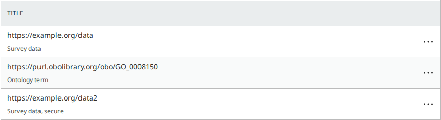

# A data citation's http:// address is saved as https:// when its type is "URI" or "PURL"

- **Severity** low
- **Effort** small
- **Kind** regression (a developer's PR introduces it; nothing is merged)
- **Affects**
  - main: nothing yet. OJS, OMP, OPS once pkp-lib#13479 merges
  - 3.5, 3.4, 3.3: none (the PR targets `main`; no data citations there)
- **Introduced** `pkp-lib#13479` for `pkp-lib#13477` · open PR, head
  [09f4461da9](https://github.com/pkp/pkp-lib/commit/09f4461da9814c9b48738304da9dd784cf18da63)
  · 2026-10-08 · Bozana Bokan (bozana)
- **Upstream** `pkp-lib#13477` (open; the PR's own issue)
- **Tracked in** ci-triage companion row `13477` · Temporary: delete once acted on
- **Checked** 2026-10-08, the PR head (the commits in Evidence)
- **Model** claude-opus-5-5

## Summary

An editor adds a data citation of type "URI" or "PURL" and types an
address that starts with "http://". With the PR the address is saved,
and shown in the table, starting with "https://", and nothing says so.
On `main` without the PR it is saved as typed.

The saved address is the data citation's identifier, so the "https://"
form is what the journal's JATS XML and its DataCite and Crossref
deposits then send. Only these two types are changed, and only when a
data citation is saved: added, its identifier edited, or copied into a
new version. It needs data citations switched on (Settings › Workflow,
off by default).

This is the review's one finding. What the PR is for works on OJS, OMP
and OPS: an arXiv ID keeps its version, and the identifiers the issue's
comment lists are no longer cut short or mangled.

## Impact

- **Lost**: the form of the address the editor or author gave; it is
  altered, not removed. A host that answers only on "http://" no longer
  opens from the saved address, and a PURL whose registered form starts
  with "http://" (the OBO ontology terms, for one) is stored in another
  form.
- **Who**: editors adding or editing a data citation of type "URI" or
  "PURL" and, by the code, authors in the submission wizard's "Data"
  section, whenever the address starts with "http://".
- **Way round**: none in the "Identifier" box. The panel's separate
  "URL" box keeps an "http://" address as typed.

Low: most hosts answer on both forms, so the saved address usually
still opens. It would be medium if a changed identifier in the JATS XML
and in the deposits counts as a wrong record, which is how
`pkp-lib#13477` itself rates the lost arXiv version.

## Steps to reproduce

Preconditions:

- PKP's default test dataset for `main` (OJS, OMP or OPS), with
  pkp-lib#13479 checked out in `lib/pkp`.

Setup:

1. Sign in as `dbarnes`.
2. Open Settings › Workflow › "Submission" › "Metadata".
3. Under "Data Citations" tick "Enable data citation metadata", choose
   "Ask the author for data citation metadata during submission." (the
   choice the steps were walked with) and press "Save".

Adding the data citations:

4. Open submission 4, "Computer Skill Requirements for New and Existing
   Teachers: Implications for Policy and Practice" [OMP: 3, "The
   Political Economy of Workplace Injury in Canada"; OPS: 1, "The
   influence of lactation on the quantity and quality of cashmere
   production"], and go to Publication › "Data" [OPS: Preprint ›
   "Data"].
5. Press "Add Data Citation". Title "Survey data", Identifier type
   "URI", Identifier "http://example.org/data", Relationship type
   "Supporting data without specifying whether they were generated or
   analyzed (supporting)."; press "Save".
6. Press "Add Data Citation" again. Title "Ontology term", Identifier
   type "PURL", Identifier "http://purl.obolibrary.org/obo/GO_0008150",
   the same relationship; press "Save".
7. The control: "Add Data Citation" once more. Title "Survey data,
   secure", Identifier type "URI", Identifier
   "https://example.org/data2", the same relationship; press "Save".

**Expected**: the table shows each address as typed,
"http://example.org/data" and
"http://purl.obolibrary.org/obo/GO_0008150".

**Observed** (the same on OJS, OMP and OPS): both saves succeed, and the
table shows "https://example.org/data" above "Survey data" and
"https://purl.obolibrary.org/obo/GO_0008150" above "Ontology term".
Step 7's address is saved as typed on both sides.

On `main` today (the PR's base):


With the PR:



## Cause

`BasePid::removePrefix()` (`lib/pkp/classes/pid/BasePid.php` line 94 at
the PR head) now starts with

```php
$string = preg_replace('#^http://#i', 'https://', trim($string));
```

so that an "http://" form of a known address (`http://doi.org/…`,
`http://hdl.handle.net/…`) matches the class's prefixes, which are
listed as "https://" addresses. That part works: those forms were
refused or garbled before and are now stored bare. (`Doi` also lists
`'http://dx.doi.org/'`, which can no longer match after the rewrite;
harmless, its "https://" twin is listed too.)

The rewritten string is also what the method returns when no prefix
matches. `PKP\pid\Url` and `PKP\pid\Purl` have no prefix at all
(`getPrefixes()` is empty), so for them nothing is removed and the
changed scheme is the result. `extractFromString()` ends in
`removePrefix()` (line 152). The `Url` pattern matches the entire
address, so all of it goes through `removePrefix()` and comes back with
the changed scheme.

Where it reaches:

- A data citation of type "URI" (`Url`) or "PURL" (`Purl`): the
  `saving` hook in `DataCitation::boot()` stores the result (lines 78
  to 83); `dataCitation\Repository::validate()` (line 86) only checks
  it. "Add Data Citation" was driven on the three apps. "Edit Data
  Citation" and the submission wizard's "Data" section save through the
  same API; they were read in the code, not driven.
- A new version of a publication: `publication\Repository::version()`
  copies each data citation with `DataCitation::create()` (line 464),
  which runs the same hook, so an address stored with "http://" before
  the PR would be rewritten in the copy without anyone editing it (read
  in the code, not driven).
- The saved identifier goes out in a journal's JATS XML (`<pub-id>`),
  its DataCite deposit (a `URL` or `PURL` related identifier) and the
  Crossref deposits of OJS and OPS (read in the code).
- Not a reference's "URL": `ExtractPidsHelper::execute()` (line 30)
  already turns "http://" into "https://" in the whole text before it
  reads any identifier, on `main` today as with the PR. Seen on screen
  on both sides.
- Not type "Accession" (no pattern, the value is kept as typed), and
  not the data citation's separate "URL" box.

## Proposed fix

Compare the prefixes against the "https://" form, and return the string
as it was given when none matches
([fix.diff](../../shared/playwright/checks/sync/pkp-lib-13479/fix.diff),
against the PR head):

```diff
-        $string = preg_replace('#^http://#i', 'https://', trim($string));
+        $string = trim($string);
+        $comparable = preg_replace('#^http://#i', 'https://', $string);
         foreach ($class::getPrefixes() as $prefix) {
-            if (stripos($string, $prefix) === 0) {
-                $string = substr($string, strlen($prefix));
+            if (stripos($comparable, $prefix) === 0) {
+                $string = substr($comparable, strlen($prefix));
                 break;
             }
         }
```

The rule stays in `BasePid`, so no caller changes, and every "http://"
form the PR newly accepts (DOI, Handle, arXiv, ARK, ORCID, PMID, PMCID,
ISSN, ECLI) is still stored bare.

This restores what `main` does for a data citation and leaves the
reference side alone, where "http://" already becomes "https://". If
the "https://" form is wanted for data citations too, that is a product
decision and wants a word in the panel's help text.

Tried on the PR head, on OJS, OMP and OPS: the steps then show Expected
on each, and the "https://" control is saved as before. The wider walk
gives the PR's results everywhere else (every point of the issue and of
its comment still fixed, the "http://doi.org/…" and
"http://n2t.net/ark:/…" forms still stored bare), and the PR's own
tests still pass with the change in (`PidExtractionTest` 26 of 26,
`DataCitationIdentifierValidationTest` 13 of 13, the citation job tests
14 of 14).

**Alternatives**

- Override `removePrefix()` in `Url`: fixes "URI" and "PURL" only.
  `Urn`, `Uuid` and `Accession` have no prefix either, and
  `Accession::removePrefix()` rewrites the scheme at the PR head too
  (no caller reaches it today).

**What goes with it**

- The guard: two cases in the PR's `PidExtractionTest`,
  `[Url::class, 'http://example.org/data', 'http://example.org/data']`
  in `removePrefixDataProvider()` and
  `[Url::class, 'See http://example.org/data.', 'http://example.org/data']`
  in `extractFromStringDataProvider()`, with `use PKP\pid\Url;` added
  to the file.
- No data repair.

Small: three lines in one method and two test cases, tried as written.

## Evidence

- Refs: pkp-lib#13479 at `09f4461da9` (one commit on the pkp-lib tip
  `2ac457888e`), checked out in `lib/pkp` of ojs `ade5f4cc56`
  (pkp/ojs#5915, the pointer bump on the ojs tip `ae8dbb47d7`), omp
  `042e72e5cf` and ops `d3da9aea1e` (their tips; no PR of their own).
  The before side is the same checkouts with `lib/pkp` at `2ac457888e`.
  PostgreSQL; nothing here depends on the database.
- The steps: `shared/playwright/checks/sync/pkp-lib-13479/http-address.js`
  on a freshly loaded default dataset,
  `SIDE=after PROBE_FEATURE=<feature> PROBE_AGENT=<id> node bin/probe.js all shared/playwright/checks/sync/pkp-lib-13479/http-address.js`
  (`SIDE=before` at the base, OJS). Its facts and the two screenshots:
  `.reports/pr13479/http/`.
- The wider walk, both sides on the three apps:
  `checks/sync/pkp-lib-13479/walk.js` (eight references whose text holds
  an identifier, four values typed in "Edit citation", nine data
  citations) and `arxiv-version.js` (the issue's own steps and its
  `neighbour` mode, the inputs the arXiv fix must leave alone);
  `.reports/pr13479/{before,after}-*/`.
- Every `PKP\pid` class over a table of 186 inputs at both commits:
  `php shared/playwright/checks/sync/pkp-lib-13479/pid-table.php <dir>`
  (the file's header has the commands). The rows that differ are the
  issue's fixes, this finding (`Url`, `Purl`), and the two notes below.
- The PR's own tests on OJS: `PidExtractionTest` 26 of 26 and
  `DataCitationIdentifierValidationTest` 13 of 13 at the head; against
  the base's classes 20 of 26 fail, and `testArxivValidation` fails.
- Fix trial: `node bin/try-fix.js apply shared/playwright/checks/sync/pkp-lib-13479/fix.diff ojs omp ops`,
  the walks, then `revert`.
- An independent read of the diff and its callers reached the same
  finding (`.reports/sync/rr13479/suspicions.md`).
- Not driven: the copy for a new version, the wizard's "Data" section,
  "Edit Data Citation", the exports.
- Read as the intended cost of the change, for the author to confirm;
  neither is counted as a finding:
  - A handle typed with its prefix and holding a space is cut at the
    space without a word: "handle:20.1000/abc def" is stored as
    "20.1000/abc" in "Edit citation" and in a data citation (on screen,
    three apps; "20.1000/abc def" before). Typed bare it is kept whole,
    and an ARK behaves the same (both `pid-table.php`).
  - A data citation identifier typed with two prefixes and no scheme,
    such as "DOI: dx.doi.org/10.1234/abc", is now refused with
    ""…" is not a valid DOI identifier." where it was saved bare
    (`pid-table.php`, not driven). "DOI: https://doi.org/10.1234/abc"
    saves bare on both sides.
