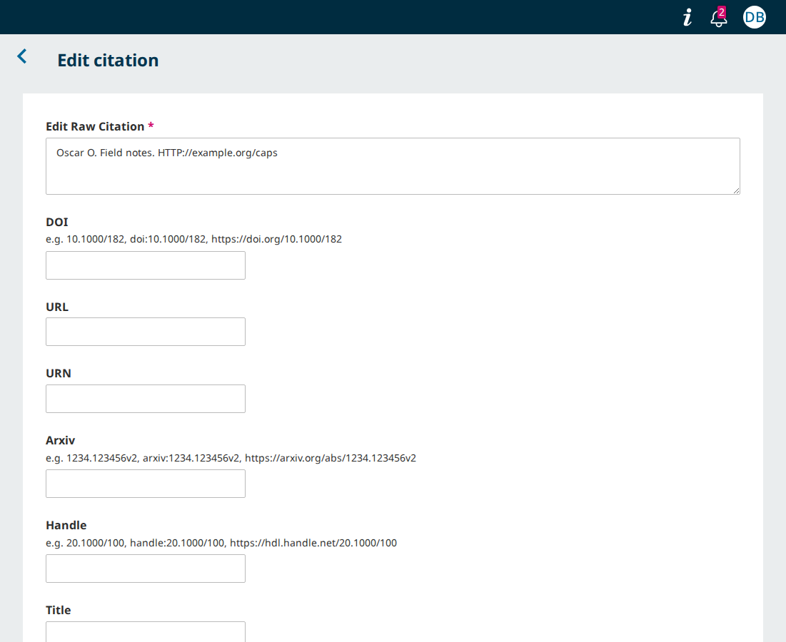

# A reference's web address written "Http://" or "HTTP://" is no longer stored as its URL

- **Severity** low
- **Effort** small
- **Kind** regression (a developer's PR introduces it; nothing is merged)
- **Affects**
  - main: nothing yet. OJS, OMP, OPS once pkp-lib#13479 merges
  - 3.5, 3.4, 3.3: none (the PR targets `main`; no metadata lookup there)
- **Introduced** `pkp-lib#13479` for `pkp-lib#13477` · open PR, its
  second commit
  [50fb7ad3b2](https://github.com/pkp/pkp-lib/commit/50fb7ad3b22582069b89d3b6a81548b6f33266be)
  · 2026-10-09 · Bozana Bokan (bozana)
- **Upstream** `pkp-lib#13477` (open; the PR's own issue)
- **Tracked in** ci-triage companion row `13477` · Temporary: delete once acted on
- **Checked** 2026-10-09, the PR head (the commits in Evidence)
- **Model** claude-opus-5-5

## Summary

With metadata lookup on, a reference is added whose text holds a web
address starting with a capital, as a word processor writes it at the
start of a sentence ("Available at: Http://example.org/sentence") or as
an all-capitals "HTTP://". With the PR the reference gets no URL: the
"URL" box of "Edit citation" stays empty and the row shows no address
link. On `main` without the PR the address is stored, as
"https://example.org/sentence".

It comes from the PR's second commit alone, which otherwise does what
it sets out to do: an address written "http://…" is kept as written, in
a reference and in a "URI" or "PURL" data citation.

## Impact

- **Lost**: the reference's URL, and with it the link on the editors'
  row. When the address is the reference's only identifier, its row
  also never shows the cited work's title and details, even once a
  title and authors are filled in, since that takes an identifier.
  Nobody is told.
- **Who**: editors and authors adding references while metadata lookup
  is on (Settings › Workflow, off by default), for a reference whose
  address starts "Http://" or "HTTP://".
- **Way round**: type the address into "URL" in "Edit citation", where
  it is kept as typed.

Low: a narrow input, in a setup that is not the default, with a way
round on the same row.

## Steps to reproduce

Preconditions:

- PKP's default test dataset for `main` (OJS, OMP or OPS), with
  pkp-lib#13479 checked out in `lib/pkp` at `50fb7ad3b2`.
- The install runs its background jobs: `job_runner = On` in
  `config.inc.php` (the default, and the dataset's), or a queue worker.

Setup:

1. Sign in as `dbarnes`.
2. Open Settings › Workflow › "Submission" › "Metadata".
3. Under "References Metadata Lookup" tick "Enable references
   structuring and metadata lookup" and press "Save".

Adding the references:

4. Open submission 4, "Computer Skill Requirements for New and Existing
   Teachers: Implications for Policy and Practice" [OMP: 3, "The
   Political Economy of Workplace Injury in Canada"; OPS: 1, "The
   influence of lactation on the quantity and quality of cashmere
   production"], and go to Publication › "References" [OPS: Preprint ›
   "References"].
5. Type these three lines in the box and press "Add":

   ```
   Oscar O. Field notes. HTTP://example.org/caps
   Quebec Q. Field notes. Available at: Http://example.org/sentence
   Papa P. Field notes. http://example.org/plain
   ```
6. Reload the page until the third row shows the link
   "http://example.org/plain" above its text: the lookup's first job has
   then run for the three references.
7. On each of the three rows press "More Actions" › "Edit", read "URL"
   and press "Close".

**Expected**: each reference has its address as its URL, as written:
"HTTP://example.org/caps", "Http://example.org/sentence" and
"http://example.org/plain".

**Observed** (the same on OJS, OMP and OPS): "URL" is empty for the
first two, and their rows show the text alone. The third reads
"http://example.org/plain".

On `main` today (the PR's base) the first two read
"https://example.org/caps" and "https://example.org/sentence":


With the PR:



## Cause

`PKP\pid\Url::regexes` (`lib/pkp/classes/pid/Url.php` line 23), the
pattern that finds an address in a text, is case-sensitive: it starts
`#https?://` and has no `i` flag. The patterns of `Doi`, `Arxiv` and
`Handle` have the flag, and so does `Url`'s own `validationRegexes`.

Until this commit that did not show for "http". The first line of
`ExtractPidsHelper::execute()` was

```php
$raw = str_ireplace('http://', 'https://', $citation->getRawCitation());
```

and `str_ireplace()` matches in any case, so "HTTP://" and "Http://"
reached the pattern as "https://". The commit replaces the line with
`$raw = $citation->getRawCitation();`, to keep the address as written,
and the two forms now reach the pattern as they are and do not match.

Where it reaches:

- A reference's `url` from the lookup's first job (`ExtractPidsJob`),
  for every reference added while lookup is on. Driven on the three
  apps through "Add"; the submission wizard's box and "Reprocess" run
  the same job (read in the code).
- Not a DOI, arXiv or handle address in capitals
  ("HTTP://DOI.ORG/10.1234/ABC" gives the DOI): their patterns ignore
  case.
- Not a data citation: of type "URI", "HTTP://example.org/data" is
  saved as typed, since the value is kept when the pattern finds
  nothing and `validationRegexes` accepts it.
- OJS's JATS XML writes a structured reference's `url` as an
  `<ext-link>` (jatsTemplate's `ArticleBack.php` line 159), so that
  link is missing too (read in the code).
- The same on both sides, so not this change: "HTTPS://example.org/x"
  and an address whose top-level domain is in capitals
  ("http://EXAMPLE.ORG/x") give no URL on `main` either.

## Proposed fix

Give the extraction pattern the `i` flag its validation twin has
([fix.diff](../../shared/playwright/checks/sync/pkp-lib-13479/fix.diff),
against the PR head, from the app's root; it adds a comment line too):

```diff
-        '#https?://(www\.)?[-a-zA-Z0-9@:%._\+~\#=]{2,256}\.[a-z]{2,}\b([-a-zA-Z0-9@:%_\+.~\#?&//=]*)#'
+        '#https?://(www\.)?[-a-zA-Z0-9@:%._\+~\#=]{2,256}\.[a-z]{2,}\b([-a-zA-Z0-9@:%_\+.~\#?&//=]*)#i'
```

The address is then stored as written ("Http://example.org/sentence"),
which is what the commit is for. It also reads the two forms `main`
misses today, "HTTPS://…" and a top-level domain in capitals.

Tried on the PR head, on OJS, OMP and OPS: the steps then show Expected
on each ("HTTP://example.org/caps" and "Http://example.org/sentence" in
"URL", each also a link on its row), and the control is unchanged. The
wider walk reads everywhere else as at the PR head, and the PR's own
tests still pass with the change in (`ExtractPidsHelperTest` 6 of 6,
`PidExtractionTest` 30 of 30, `DataCitationIdentifierValidationTest`
13 of 13, the citation job tests 14 of 14).

**Alternatives**

- Lower-case the scheme in `ExtractPidsHelper` before the read: brings
  back a rewrite of the text, which the commit set out to remove.

**What goes with it**

- The guard: one more case for the PR's `ExtractPidsHelperTest`
  (not in the runs above, which are the PR's own six),
  `['Smith J. Report. Available at: Http://example.org/report', ['url' => 'Http://example.org/report']]`.
- No data repair.

Small: one character and a test case, tried as written.

## Evidence

- Refs: pkp-lib#13479 at `50fb7ad3b2` (two commits on the pkp-lib tip
  `15f9f72323`; the first, `4b378844aa`, is round 1's `09f4461da9`
  rebased, `git range-diff` `=`), checked out in `lib/pkp` of ojs
  `90fcedeac8` (pkp/ojs#5915, the pointer bump on the ojs tip
  `7fe6502315`), omp `77ca57587a` and ops `dafd9b3263` (their tips; no
  PR of their own). The before side is the same checkouts with `lib/pkp`
  at `15f9f72323`. PostgreSQL; nothing here depends on the database.
- The steps: `shared/playwright/checks/sync/pkp-lib-13479/caps-url.js`
  on a freshly loaded default dataset,
  `SIDE=after PROBE_FEATURE=<feature> PROBE_AGENT=<id> node bin/probe.js all shared/playwright/checks/sync/pkp-lib-13479/caps-url.js`
  (`SIDE=before` at the base, OJS). The script reloads four times and
  then reads the three rows.
- The wider walk, both sides on the three apps: `walk.js` beside it
  (thirteen references, four values typed in "Edit citation", eleven
  data citations), with `arxiv-version.js` and `http-address.js` at the
  head. Every case reads as the PR intends but the capitals one.
- `pid-table.php` beside them: every `PKP\pid` class over 195 inputs,
  and the first job's reads over 32 reference texts, at the base, at
  round 1's head and at this head (the file's header has the commands).
  Against round 1 only `Url`, `Purl` and a reference's `url` differ.
- The PR's own tests on OJS: `ExtractPidsHelperTest` 6 of 6,
  `PidExtractionTest` 30 of 30 and `DataCitationIdentifierValidationTest`
  13 of 13 at the head; against the base's classes 4 of 6, 22 of 30 and
  `testArxivValidation` fail.
- Fix trial: `node bin/try-fix.js apply shared/playwright/checks/sync/pkp-lib-13479/fix.diff ojs omp ops`,
  the walks, then `revert`.
- Not driven: the submission wizard's box, "Reprocess".
