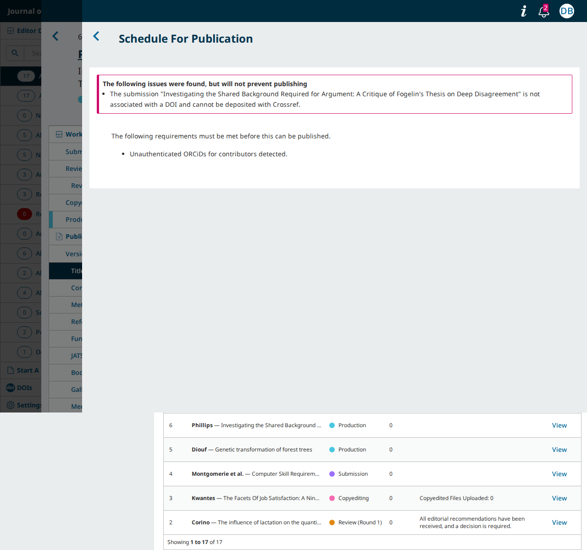
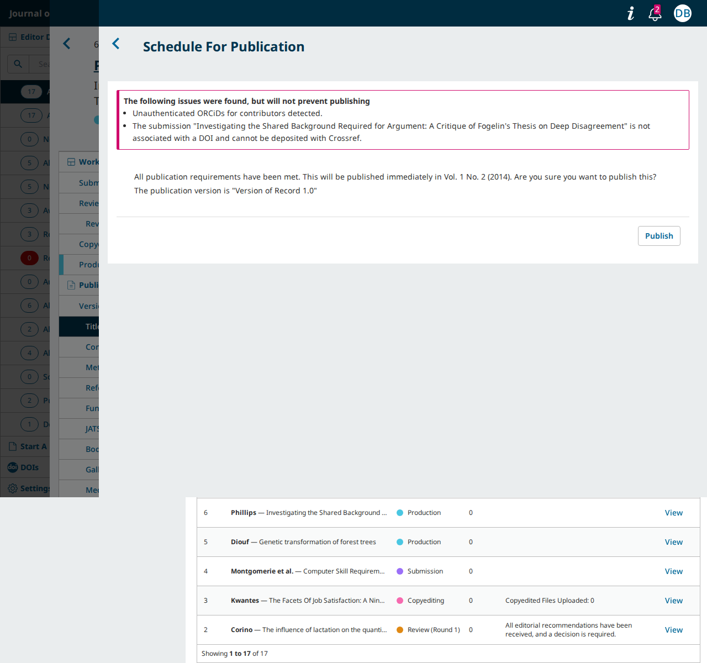
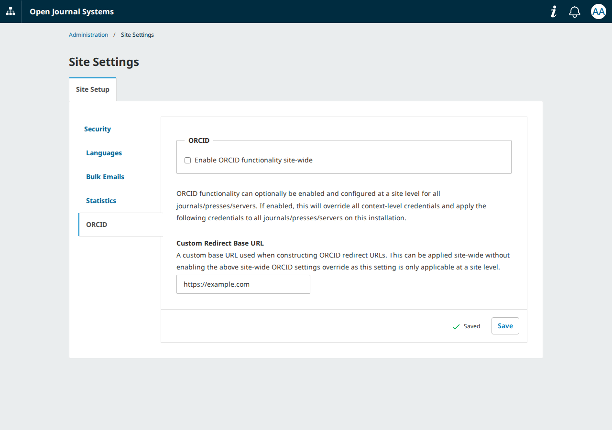
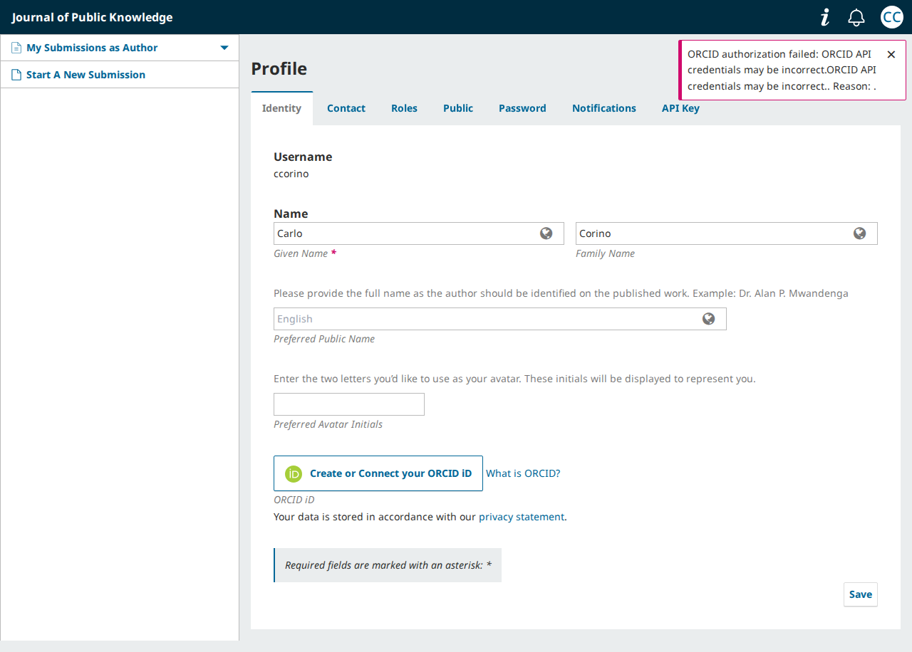

# The ORCID fixes for `main` do what the issue asks, except for a redirect address typed without its closing slash

- **Severity** medium (finding 2; the three others are low)
- **Effort** small
- **Kind** intention gap (in open PRs; nothing is merged on `main`)
- **Affects**
  - main: nothing yet. Once pkp-lib#13493 merges: OJS (finding 1); OJS, OMP, OPS (findings 2 to 4)
  - 3.5: OJS, OMP, OPS on the `stable-3_5_0` branch, where the same patches merged on 2026-10-02; no released version has them yet (the latest is 3.5.0-5). Findings 2 and 3 were walked there, finding 4 was read in the code. Finding 1 is not there: that branch's Crossref plugin does not add to the publish window's warnings
  - 3.4: none (read in the code: ORCID is the ORCID Profile plugin there)
  - 3.3: none (read in the code: the same)
- **Introduced** `pkp-lib#13493` for `pkp-lib#13283` · open PR, head
  [e29a720de0](https://github.com/pkp/pkp-lib/pull/13493/commits/e29a720de0c03d08dfe4a1a0bd792b19089b23f3) ·
  2026-10-09 · Erik Hanson (ewhanson)
- **Upstream** `pkp-lib#13283` (open; it lists these PRs)
- **Tracked in** ci-triage companion row `i13283-main` · Temporary: delete once acted on
- **Checked** 2026-10-09, the PR heads and their bases (the commits in Evidence)
- **Model** claude-opus-5-5

## Summary

PR review of the `main` PRs of pkp/pkp-lib#13283: pkp-lib#13493 with
ojs#5920, omp#2503 and ops#1444. Each of the issue's five acceptance
criteria was tried on PKP's default dataset before the change and with
it, on OJS, OMP and OPS. Nothing that worked before breaks, and the
criteria are met, with one exception: the redirect address works only
when it is typed with a closing slash, and the issue's own example value
has none (finding 2).

| # | Acceptance criterion | Before (pkp-lib `7cc6c81615`) | With the PRs (`e29a720de0`) |
|---|---|---|---|
| 1, 4 | ORCID emails: new variables, the submission's title | An upgrade from 3.3 leaves `{$authorName}` in the bodies (OJS, OPS); "Submission ORCID" names no title | Upgrades from 3.5, 3.4 and 3.3 complete; default and customized bodies lose the two old variables; the email greets the contributor, names the title and closes with the journal's signature; a second run changes nothing |
| 2 | "Custom Redirect Base URL" | No such field; no "ORCID" tab in Site Settings on a one-journal site | The tab and the field are there on every site; with `https://example.com/` stored, every ORCID link returns to that address; an old `config.inc.php` line is copied in by the upgrade. Without the closing slash: finding 2 |
| 3 | A wrong client secret on the profile | The return from ORCID answers 500 and leaves a blank popup | The popup closes and the profile shows "ORCID authorization failed: …" |
| 5 | An unauthenticated iD and publishing | The publish window refuses, with no button | The window warns and "Publish" ("Post") publishes |

Four things are left. Each has a small fix that was tried on the PR
heads:

| # | Finding | Severity | Fix | Where |
|---|---|---|---|---|
| [1](#finding-1) | OJS with Crossref: the publish window shows Crossref's warning and drops the ORCID one | low | one line | pkp/crossref-ojs, `main` |
| [2](#finding-2) | "Custom Redirect Base URL" typed without a closing slash (the issue's own example) builds a broken return address | medium | one line | pkp-lib, `main` and `stable-3_5_0` |
| [3](#finding-3) | An old `config.inc.php` line overwrites the redirect address set on screen at the next upgrade | low | six lines in the migration | pkp-lib, `main` and `stable-3_5_0` |
| [4](#finding-4) | A refusal from ORCID without a readable reason gives a garbled notice on the profile | low | two lines | pkp-lib, `main` and `stable-3_5_0` |

What this asks of the team: finding 2's line is worth taking into
pkp-lib#13493 before it merges, and into `stable-3_5_0` before 3.5.0-6,
since it is the difference between criterion 2 working and not for a
value the issue itself gives. Findings 1, 3 and 4 can follow the merge.
Whether the PRs merge as they are is the team's call.

The PRs' own e2e checks are red on one test in each app, the profile's
email change (pkp-e2e's U03 scenario 4), which is red on `main` too since
pkp-lib#12780. The apps' own Cypress jobs fail at "Installs the software"
with a page-load timeout, as they do on the base commits' own runs.

<a id="finding-1"></a>
## Finding 1 — OJS with Crossref: the publish window shows Crossref's warning and drops the ORCID one

A journal that registers its DOIs with Crossref gets Crossref's own
warnings in the publish window (an article without a DOI, a journal
without an ISSN or a publisher). When there is one, the new warning about
an unauthenticated or duplicate ORCID iD is missing from the list, and
the editor publishes without being told.

### Impact

- **Lost**: one line of the warning list, the one this change adds. The
  article is published as it should be.
- **Who**: editors of OJS journals where Crossref is the registration
  agency, article DOIs are on and "Automatic DOI Assignment" is anything
  but "Upon publication", for an article Crossref also has a warning
  about. OMP and OPS are not affected.
- **Way round**: the contributor's "ORCID iD" field still shows the iD as
  unverified.

Low: the task gets done, and the iD's state can still be read on the
contributor.

### Steps to reproduce

On PKP's default test dataset for `main` (OJS), with the PR heads checked
out.

1. As `rvaca`: Settings › Users & Roles › "ORCID": tick "Enable ORCID
   functionality", "ORCID API" "Public Sandbox", "Client ID" `APP-TEST`,
   "Client Secret" `test-secret`, "Save".
2. Give the contributor of submission 6 ("Investigating the Shared
   Background Required for Argument: A Critique of Fogelin's Thesis on
   Deep Disagreement") an iD that is not verified. ORCID's sign-in cannot
   complete on a test install, so by SQL:

   ```sql
   INSERT INTO author_settings (author_id, locale, setting_name, setting_value)
   SELECT a.author_id, '', 'orcid', 'https://sandbox.orcid.org/0000-0002-1825-0097'
   FROM authors a JOIN submissions s ON s.current_publication_id = a.publication_id
   WHERE s.submission_id = 6;
   ```
3. Settings › Website › "Plugins": tick "Crossref Manager Plugin".
4. Settings › Distribution › "DOIs" › "Setup": "DOI Prefix" `10.1234`,
   "Save". Then "Registration": "Registration Agency" "Crossref",
   "Depositor name" `Public Knowledge Project`, "Depositor email"
   `doi@mailinator.com`, "Save". ("Automatic DOI Assignment" stays as the
   dataset has it, "Upon reaching the copyediting stage".)
5. As `dbarnes`, open submission 6, Publication › "Title & Abstract", and
   press "Schedule For Publication". In "Review Publishing Details" choose
   "Version of Record (VoR)", "Major Revision" and "Assign To Current/Back
   Issue" › "Vol. 1 No. 2 (2014)", then "Confirm".

**Expected**: under "The following issues were found, but will not
prevent publishing", both "The submission "Investigating the Shared
Background …" is not associated with a DOI and cannot be deposited with
Crossref." and "Unauthenticated ORCiDs for contributors detected."

**Observed**: the Crossref line alone, "All publication requirements
have been met." and "Publish".

Before the change, the same window:



With the PRs:


With the fix below:



Control: once the article has a DOI (DOIs › "Articles" › tick the row ›
"Bulk Actions" › "Assign DOIs"), Crossref has nothing to warn about and
the window lists the ORCID line. Without Crossref as the agency it lists
it too.

### Cause

`PKP\publication\Repository::validatePublishWarnings()` now fills the
list with the ORCID warnings and then calls the
`Publication::validatePublishWarnings` hook. OJS's Crossref plugin is the
hook's one subscriber in the three apps. Its `validate()` returns early
unless Crossref is the configured agency, article DOIs are on and the
DOI creation time is not "publication"; past that, it replaces the list
instead of adding to it (`plugins/generic/crossref/CrossrefPlugin.php`):

```php
$errors = & $args[0];
…
if (!$validator->passes()) {
    $errors = $this->formatErrors($validator->errors()->toArray());
}
```

Until this change the list was always empty when the hook ran, so the
replacement cost nothing.

### Proposed fix

In pkp/crossref-ojs, add to the list (tried on OJS at the PR heads: the
window then lists both lines and still offers "Publish"):

```diff
-            $errors = $this->formatErrors($validator->errors()->toArray());
+            $errors = array_merge($errors, $this->formatErrors($validator->errors()->toArray()));
```

The other way stays inside pkp-lib#13493: add the ORCID warnings after
the hook has run. The ORCID lines would then survive, while the plugin
would still drop whatever another plugin added before it. Not tried.

<a id="finding-2"></a>
## Finding 2 — "Custom Redirect Base URL" typed without a closing slash builds a broken return address

The issue's acceptance criteria give `https://example.com` as the value.
The field accepts it, and from then on every ORCID link the site builds
carries a return address on a host that does not exist,
`https://example.comindex.php/…`.

### Impact

- **Lost**: the return from ORCID, for every ORCID link of the site while
  the value is stored: the "Create or Connect your ORCID iD" button on
  the profile, on the registration page and in the invitation wizard,
  and the authorization links in the emails to contributors. Seen in the
  links' addresses; what ORCID then shows the user was not tried, since
  its sign-in cannot complete on a test install.
- **Who**: sites that type the value without a closing slash, and sites
  whose `config.inc.php` line has none, since the upgrade copies it as
  written.
- **Way round**: add the slash. Nothing on the screen says so: the save
  answers "Saved".

Medium: a task fails with a way round on screen, on a setting few sites
use.

### Steps to reproduce

On PKP's default test dataset for `main`, with the PR heads checked out.
OJS, OMP and OPS are the same, and so is the 3.5 dataset on the tip of
`stable-3_5_0`.

1. As `admin`: Administration › Site Settings › "ORCID". In "Custom
   Redirect Base URL" type `https://example.com` and press "Save": "Saved".
2. As `rvaca`: Settings › Users & Roles › "ORCID": tick "Enable ORCID
   functionality", "Public Sandbox", "Client ID" `APP-TEST`, "Client
   Secret" `test-secret`, "Save".
3. As any user, open the profile's "Identity" tab and press "Create or
   Connect your ORCID iD". Read `redirect_uri` in the popup's address.

**Expected**: `https://example.com/index.php/publicknowledge/orcid/authorizeOrcid?targetOp=profile`

**Observed**: `https://example.comindex.php/publicknowledge/orcid/authorizeOrcid?targetOp=profile`

The registration page's button gives
`https://example.comindex.php/publicknowledge/orcid/authorizeOrcid?targetOp=register`,
and the link in the "Submission ORCID" email ("Request verification" on
a contributor) `https://example.comindex.php/publicknowledge/orcid/verify?token=…`.
With `https://example.com/` stored, all three are right.



### Cause

`PKP\orcid\OrcidManager::buildOAuthUrl()`, which builds every one of
these links, replaces the scheme, the host and the slash after it with
the stored value as typed:

```php
$redirectUrl = preg_replace("#^https{0,1}:\/\/(.*)\/#U", $customRedirectUrl, $redirectUrl);
```

The pattern is the ORCID Profile plugin's from 3.3, whose README gave
the value with its slash (`"https://my_orcid_redirect.url/"`), so a
value without one did not work there either. The new field's description
does not mention the slash and its `url` rule accepts both forms.

### Proposed fix

Put the slash back whatever was typed (tried on the three apps: the
profile's, the registration page's and the email's addresses are right
with and without the slash):

```diff
-            $redirectUrl = preg_replace("#^https{0,1}:\/\/(.*)\/#U", $customRedirectUrl, $redirectUrl);
+            $redirectUrl = preg_replace("#^https{0,1}:\/\/(.*)\/#U", rtrim($customRedirectUrl, '/') . '/', $redirectUrl);
```

The value stands for the scheme and the host only. A value that carries
a path is not handled, with the fix or without it; the field's
description could say which is meant.

<a id="finding-3"></a>
## Finding 3 — An old `config.inc.php` line overwrites the redirect address set on screen at the next upgrade

The migration copies `orcid_redirect_base_url` from `config.inc.php` into
the site setting whenever the line is there, also when the setting already
holds another value.

### Impact

- **Lost**: the address typed in Site Settings › "ORCID", replaced by the
  old one from the config file. From then on ORCID returns users to the
  old address.
- **Who**: sites that had the line in `config.inc.php`, changed the
  address on screen later and left the line in the file. On
  `stable-3_5_0` the migration runs at every upgrade from one 3.5.0
  version to the next, so this happens at each of them from 3.5.0-6 on.
  On `main` it runs once, at the upgrade from 3.5 to 3.6.
- **Way round**: remove the line from `config.inc.php`, as the new
  release notes suggest ("These can safely be removed post-migration").

Low: a rarely met state, with a way round the release notes name.

### Steps to reproduce

1. Load PKP's default test dataset for `stable-3_5_0` (version 3.5.0.5).
2. Store the address a site would have set on screen after its first
   upgrade (in the walk by SQL, since 3.5.0.5 has no such field):

   ```sql
   INSERT INTO site_settings (setting_name, locale, setting_value)
   VALUES ('orcidCustomRedirectBaseUrl', '', 'https://new.example.org/');
   ```
3. Add to `config.inc.php`:

   ```ini
   [orcidProfilePlugin]
   orcid_redirect_base_url = "https://old.example.org/"
   ```
4. With the PR heads checked out, run `php tools/upgrade.php upgrade`:
   "Successfully upgraded to version 3.6.0.0".
5. Read the setting (Site Settings › "ORCID", or the `site_settings` row).

**Expected**: `https://new.example.org/`

**Observed**: `https://old.example.org/` (OJS, OMP and OPS). On the tip
of `stable-3_5_0` (OJS), steps 2 and 3 followed by the migration's own
command give the same:

```bash
php lib/pkp/tools/migration.php "\PKP\migration\upgrade\v3_5_0\I13283_RestoreDegradedOrcidFunctionality" up
```

### Cause

`I13283_RestoreDegradedOrcidFunctionality::moveRedirectUrlSiteSetting()`
writes with `updateOrInsert()` whenever the config value is not empty.
The app PRs list the migration in the `3.5.0.0`–`3.5.0.99` block of
`dbscripts/xml/upgrade.xml`.

### Proposed fix

Let the config value fill only an empty or missing setting (tried on the
three apps: the value set on screen is kept, and a site without one still
gets the config line's):

```diff
+        $stored = DB::table('site_settings')
+            ->where('setting_name', 'orcidCustomRedirectBaseUrl')
+            ->value('setting_value');
+        if (!empty($stored)) {
+            return;
+        }
+
         DB::table('site_settings')
             ->updateOrInsert(
```

One case stays open with it: a field emptied on screen is filled from
the config line again at the next upgrade, since an emptied setting and
one never set look the same.

<a id="finding-4"></a>
## Finding 4 — A refusal from ORCID without a readable reason gives a garbled notice on the profile

When ORCID refuses the site's credentials and its answer carries no
reason the app can read, the notice on the profile repeats its sentence
and ends in stray punctuation.

### Impact

- **Lost**: nothing but the wording of a notice.
- **Who**: a user connecting their iD while the answer to the site is a
  401 without ORCID's own JSON, from a gateway or proxy in front of it
  for instance. ORCID's own refusal reads correctly: its sandbox answers
  a made-up client with
  `{"error_description":"Client authentication failed","error":"invalid_client"}`
  (one request made by hand, Evidence), which the app shows as "ORCID
  authorization failed: Client authentication failed. Reason:
  invalid_client."
- **Way round**: none needed.

Low: wording only, in a case few sites meet.

### Steps to reproduce

No screen of a test install reaches these answers: ORCID's token
endpoint has to be stood in. The kept check does it (its commands are in
Evidence): the install's `[proxy]` `http_proxy` and `https_proxy` point
at a local proxy that answers for ORCID, and PHP is started with a
`curl.cainfo` line naming that proxy's certificate. The two rows can also
be confirmed by reading the method in Cause.

On PKP's default test dataset for `main`, with ORCID turned on for the
journal (step 2 of finding 2, without its step 1), as `ccorino`: the
profile's "Identity" tab, "Create or Connect your ORCID iD", then the
return from ORCID (`…/orcid/authorizeOrcid?targetOp=profile&code=abc123`)
loaded in the popup while the stand-in answers:

| The answer to the site | Notice on the profile |
|---|---|
| 401, a body that is not JSON | "ORCID authorization failed: ORCID API credentials may be incorrect.ORCID API credentials may be incorrect.. Reason: ." |
| 401 `{}` | "ORCID authorization failed: ORCID API credentials may be incorrect.. Reason: ." |

**Expected** for both: "ORCID authorization failed: ORCID API
credentials may be incorrect."



### Cause

`AuthorizeUserData::getAuthErrorDisplayMessage()` adds the default
sentence in each fallback branch and then goes on to add the description
and the reason, both empty:

```php
if (json_last_error() !== JSON_ERROR_NONE) {
    $message .= $defaultReason;
}
…
if (empty($description) || empty($errorReason)) {
    $message .= $defaultReason;
}

$message .= $description . '. Reason: ' . $errorReason . '.';
```

### Proposed fix

Leave the `case` after each fallback (tried on the three apps: both
answers then read "ORCID authorization failed: ORCID API credentials may
be incorrect."):

```diff
-                    if (json_last_error() !== JSON_ERROR_NONE) {
+                    if (json_last_error() !== JSON_ERROR_NONE || !is_array($errorData)) {
                         $message .= $defaultReason;
+                        break;
                     }
…
                     if (empty($description) || empty($errorReason)) {
                         $message .= $defaultReason;
+                        break;
                     }
```

The `is_array()` test is not needed for the two rows above. An answer
with only one of the two fields then reads as the default sentence too,
and the one field ORCID did send is dropped.

## Also seen, not counted as findings

- **Armenian keeps `{$authorName}`** in "Submission ORCID"
  (`locale/hy/emails.po`, `emails.orcidCollectAuthorId.body`), the one
  language of 43 with an old variable left. Read in the file, not sent:
  the dataset has no Armenian.
- **A 5xx from ORCID, or no connection to it, still ends in a blank
  popup** (seen: HTTP 500 and the popup stays open). The change catches
  4xx answers, which is what the issue asks for.
- **The warning lives in the publish window alone.** OMP's Catalog "Add
  Entry" now publishes a book whose contributor has an unauthenticated
  iD without a word (it refused before, with "The form was not saved
  because 1 error(s) were encountered."), and the REST publish route
  answers 200 with nothing about it.
- **Two contributors with the same unauthenticated iD** read
  "Unauthenticated ORCiDs for contributors detected." only; "Duplicate
  ORCiDs for contributors detected." shows when both are verified. As
  before the change.
- **A customized "Submission ORCID" gains no title**, and French (Canada)
  has no title in its default yet: the upgrade re-installs the default
  English text only.
- **An install already on `main`** (version 3.6.0.0, PKP's `main` dataset
  included) gets no migration. After the merge "Submission ORCID" and
  "Requesting ORCID record access" close with the text
  `{$principalContactSignature}` there (seen on the dataset as loaded;
  "Requesting updated ORCID record access" holds the same variable and
  was not sent), until the three templates are re-installed:
  `php lib/pkp/tools/installEmailTemplate.php ORCID_COLLECT_AUTHOR_ID`,
  then `ORCID_REQUEST_AUTHOR_AUTHORIZATION` and `ORCID_REQUEST_UPDATE_SCOPE`.
- **Four known ORCID defects are untouched**, as expected, since the
  change does not aim at them; their kept walks were run at the PR heads
  and all four still show: the re-authorization link's blank page
  ([pkp-e2e U04 A14](../specs/U04-orcid-integration.md#a14)), the raw
  `##orcid.authDenied##` after "Deny"
  ([U04 A2](../specs/U04-orcid-integration.md#a2)), publishing without an
  issue under the member API
  ([U49 OJS4](../specs/U49-publish-schedule-and-versions.md#ojs4)) and
  the ORCID emails listed under code names
  ([U56 A2](../specs/U56-emails-management.md#a2)).

## Evidence

- **Commits.** pkp-lib#13493 `e29a720de0` on `7cc6c81615`; ojs#5920
  `16632fffb6` on `0be39c5ce4`; omp#2503 `0d1b2d2025` on `77ca57587a`;
  ops#1444 `f45042e0ec` on `dafd9b3263`. The "before" side: the apps at
  those bases with `lib/pkp` at `7cc6c81615`. `stable-3_5_0`: pkp-lib
  `d702d012dd` (OJS), `8094f06bf5` (OMP, OPS); no tag contains the
  patches (`git tag --contains 0afbf72eb3` is empty, the latest tag is
  `3_5_0-5`).
- **The same patch as 3.5.** `git range-diff` of the PR against 3.5's
  `0afbf72eb3^..29b76297a3`: commits 1 to 4 equal up to context, commit
  5 moved only the ORCID block, since `validatePublishWarnings()` and its
  hook were on `main` already.
- **Kept checks**, `shared/playwright/checks/sync/pkp-lib-13493/`, each
  run on PKP's default dataset at the base, at the PR heads and at the
  heads with the fixes; they record and do not assert:
  - `publish-warning.js`: the publish window per case (no iD, an
    unauthenticated one, duplicates, the REST route, OMP's "Add Entry",
    Crossref with and without something to warn about).
  - `site-orcid-tab.js`: the Site Settings tab on a site with one journal
    and with two, the redirect field's saves, and the return addresses of
    the profile's button, the registration page's button and the emailed
    link per stored value. The invitation wizard's button and the
    re-authorization email go through the same method and were not read.
  - `orcid-emails.js`: the two request emails as sent, and the stored
    templates.
  - `upgrade.js`: PKP's 3.5, 3.4 and 3.3 datasets upgraded per case (as
    shipped, old-shape and customized templates, the config line with and
    without a stored setting), the migration run a second time by its
    command.
  - `profile-connect-error.js` with `orcid-token-stub.js`: the return
    from ORCID for seven token-endpoint answers, on the profile and in
    the invitation wizard; the registration page's return was not walked.
    The stand-in is a local proxy that ends TLS with a throwaway
    certificate authority; the app's own calls never leave the machine.
    Setup, once per install (pkp-e2e commands):

    ```bash
    D=$PWD/.reports/pr13493d/pf/orcid-stub
    node shared/playwright/checks/sync/pkp-lib-13493/orcid-token-stub.js --init --dir $D
    npm run probe-servers -- --stop --dataset 4
    PHP_INI_SCAN_DIR=:$D/php npm run probe-servers -- --start --dataset 4
    npm run fleet-prep -- --feature pr13493d --dataset 4 --reset
    PROBE_FEATURE=pr13493d PROBE_AGENT=pf node bin/probe.js all shared/playwright/checks/sync/pkp-lib-13493/profile-connect-error.js
    ```
  - `fix.diff` (pkp-lib, findings 2 to 4) and `fix-ojs.diff` (the same
    plus the Crossref plugin's line), applied with `bin/try-fix.js`.
- **ORCID's own refusal** (finding 4, "Who"): one request made by hand
  to `https://sandbox.orcid.org/oauth/token` with a made-up client ID,
  secret and code, to read the shape of the answer: 401 with the body
  quoted there. The stand-in's row for a refused client uses another
  description ("Client not found: APP-TEST"), written before that
  request; the app treats both alike.
- **Finding 1 on a new journal.** The regression read met it first on
  scratch journals without an ISSN or a publisher: three Crossref lines
  and no ORCID line.
- **Whole suites.** The PRs' own e2e checks ran `main`'s suites at the PR
  heads: OJS run 37962117216, OMP 37962879325, OPS 37963217217.
- **Not tried.** A real sign-in at ORCID; what ORCID answers to the
  broken return address of finding 2; the Armenian email; the
  registration page after a refused connect.
